# MonopolyBattle — Software Architecture Document

> **Version:** 1.1  
> **Date:** 2026-06-27  
> **Author:** Senior Software Architect  
> **Status:** Draft — Awaiting Review  
> **Changelog:** v1.1 — Added §16 Vietnamese Language Architecture, §17 Content Architecture, §18 Enhanced AI Narrator

---

## Table of Contents

1. [Overall Architecture](#1-overall-architecture)
2. [Frontend Architecture](#2-frontend-architecture)
3. [Backend Architecture](#3-backend-architecture)
4. [Database Schema](#4-database-schema)
5. [Socket.IO Event Flow](#5-socketio-event-flow)
6. [Game Lifecycle](#6-game-lifecycle)
7. [Game Engine Architecture](#7-game-engine-architecture)
8. [Educational Engine](#8-educational-engine)
9. [AI Narrator Architecture](#9-ai-narrator-architecture)
10. [Security](#10-security)
11. [Deployment Architecture](#11-deployment-architecture)
12. [Folder Structure](#12-folder-structure)
13. [State Management](#13-state-management)
14. [Coding Conventions](#14-coding-conventions)
15. [Future Extensibility](#15-future-extensibility)
16. [Vietnamese Language Architecture](#16-vietnamese-language-architecture)
17. [Content Architecture](#17-content-architecture)
18. [Enhanced AI Narrator System](#18-enhanced-ai-narrator-system)

---

## 1. Overall Architecture

### 1.1 System Context Diagram

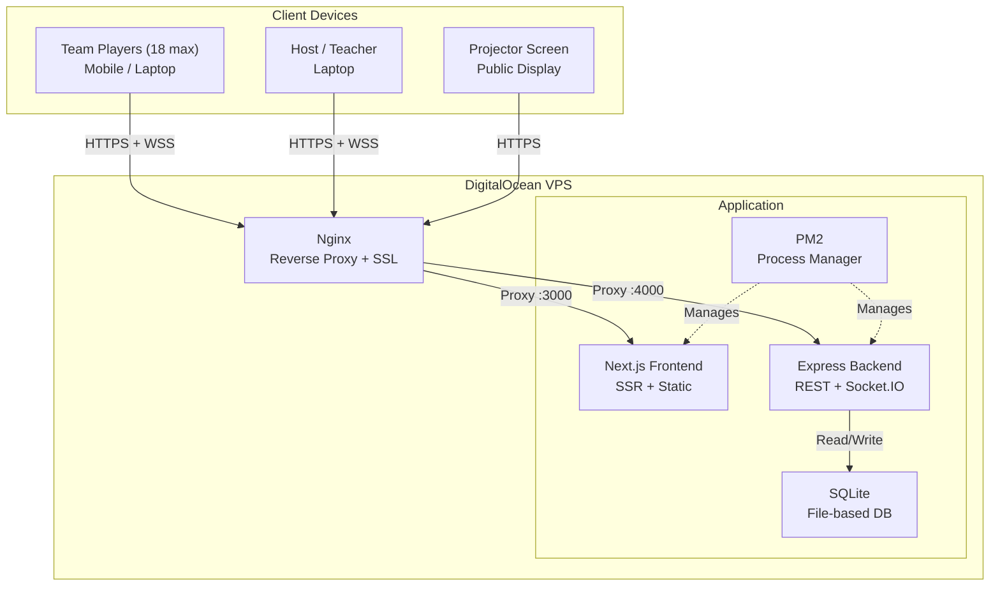
```mermaid
graph TB
    subgraph "Client Devices"
        P1["Team Players (18 max)<br/>Mobile / Laptop"]
        HOST["Host / Teacher<br/>Laptop"]
        PROJ["Projector Screen<br/>Public Display"]
    end

    subgraph "DigitalOcean VPS"
        NGINX["Nginx<br/>Reverse Proxy + SSL"]
        subgraph "Application"
            NEXT["Next.js Frontend<br/>SSR + Static"]
            EXPRESS["Express Backend<br/>REST + Socket.IO"]
            SQLITE["SQLite<br/>File-based DB"]
            PM2["PM2<br/>Process Manager"]
        end
    end

    P1 -->|HTTPS + WSS| NGINX
    HOST -->|HTTPS + WSS| NGINX
    PROJ -->|HTTPS| NGINX
    NGINX -->|Proxy :3000| NEXT
    NGINX -->|Proxy :4000| EXPRESS
    EXPRESS -->|Read/Write| SQLITE
    PM2 -.->|Manages| NEXT
    PM2 -.->|Manages| EXPRESS
```

### 1.2 High-Level Architecture

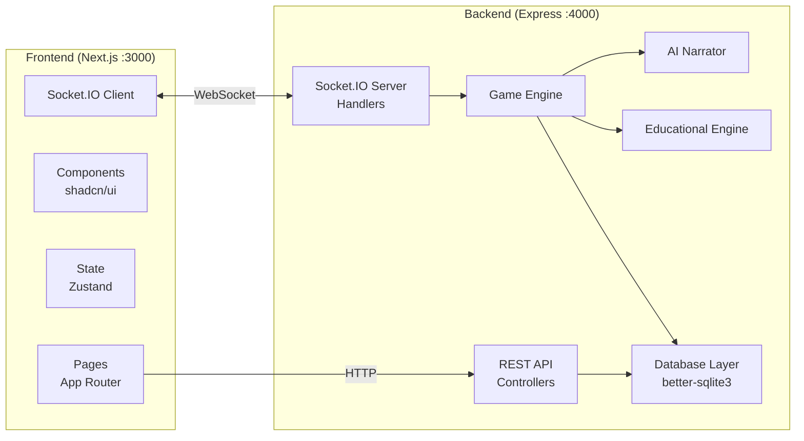
```mermaid
graph LR
    subgraph "Frontend (Next.js :3000)"
        PAGES["Pages<br/>App Router"]
        COMPONENTS["Components<br/>shadcn/ui"]
        STORE["State<br/>Zustand"]
        SOCKET_CLIENT["Socket.IO Client"]
    end

    subgraph "Backend (Express :4000)"
        REST["REST API<br/>Controllers"]
        WS["Socket.IO Server<br/>Handlers"]
        ENGINE["Game Engine"]
        NARRATOR["AI Narrator"]
        EDU["Educational Engine"]
        DB_LAYER["Database Layer<br/>better-sqlite3"]
    end

    SOCKET_CLIENT <-->|WebSocket| WS
    PAGES -->|HTTP| REST
    WS --> ENGINE
    ENGINE --> NARRATOR
    ENGINE --> EDU
    ENGINE --> DB_LAYER
    REST --> DB_LAYER
```

### 1.3 Architecture Principles

| Principle | Rationale |
|---|---|
| **Monolithic** | 18 players max. No need for microservices. Single VPS deployment. |
| **In-process game engine** | All game logic runs in a single Node.js process. No message queues. |
| **SQLite over PostgreSQL** | Lightweight, zero-config, sufficient for ≤18 concurrent users. |
| **Template-based AI** | Deterministic narration from templates. No external LLM dependency. |
| **Server-authoritative** | All game state lives on the server. Clients are thin views. |
| **Event-driven via Socket.IO** | Real-time bidirectional communication for game state sync. |

### 1.4 Communication Patterns

| Path | Protocol | Purpose |
|---|---|---|
| Client ↔ Backend | WebSocket (Socket.IO) | Real-time game events, state sync |
| Client → Backend | HTTP REST | Auth, game creation, quiz submission |
| Backend → SQLite | Synchronous API | Persistence (better-sqlite3, not async) |
| Nginx → Apps | HTTP Proxy | Reverse proxy with SSL termination |

---

## 2. Frontend Architecture

### 2.1 Pages (App Router)

```
app/
├── page.tsx                    # Landing page — join or host
├── host/
│   ├── page.tsx                # Host dashboard — create game
│   ├── lobby/page.tsx          # Host lobby view — see teams joining
│   └── control/page.tsx        # Host control panel during game
├── play/
│   ├── join/page.tsx           # Player join — enter room code + team
│   ├── lobby/page.tsx          # Player waiting room
│   └── game/page.tsx           # Main game screen for players
├── projector/
│   └── page.tsx                # Public projector view (read-only)
└── results/
    └── page.tsx                # Final leaderboard + educational summary
```

### 2.2 Page Responsibilities

| Page | Role | Auth Required | Socket |
|---|---|---|---|
| `/` | Landing, role selection | No | No |
| `/host` | Create a game session, set parameters | Host PIN | No |
| `/host/lobby` | Display QR code, see teams join | Host | Yes |
| `/host/control` | Start rounds, trigger events, pause | Host | Yes |
| `/play/join` | Enter room code, pick team name | No | No |
| `/play/lobby` | Wait for game to start | Player | Yes |
| `/play/game` | Make decisions, answer quizzes | Player | Yes |
| `/projector` | Full-screen display for audience | Room code | Yes (read-only) |
| `/results` | End-game leaderboard + summary | No | No |

### 2.3 Component Hierarchy

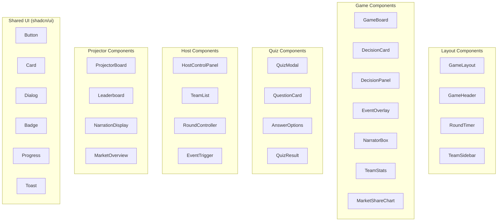
```mermaid
graph TD
    subgraph "Layout Components"
        LAYOUT["GameLayout"]
        HEADER["GameHeader"]
        TIMER["RoundTimer"]
        SIDEBAR["TeamSidebar"]
    end

    subgraph "Game Components"
        BOARD["GameBoard"]
        DECISION["DecisionCard"]
        DECISION_LIST["DecisionPanel"]
        EVENT_OVERLAY["EventOverlay"]
        NARRATOR_BOX["NarratorBox"]
        STATS["TeamStats"]
        CHART["MarketShareChart"]
    end

    subgraph "Quiz Components"
        QUIZ["QuizModal"]
        QUESTION["QuestionCard"]
        ANSWERS["AnswerOptions"]
        QUIZ_RESULT["QuizResult"]
    end

    subgraph "Host Components"
        HOST_PANEL["HostControlPanel"]
        TEAM_LIST["TeamList"]
        ROUND_CTRL["RoundController"]
        EVENT_TRIGGER["EventTrigger"]
    end

    subgraph "Projector Components"
        PROJ_BOARD["ProjectorBoard"]
        LEADERBOARD["Leaderboard"]
        NARRATION_DISPLAY["NarrationDisplay"]
        MARKET_OVERVIEW["MarketOverview"]
    end

    subgraph "Shared UI (shadcn/ui)"
        BUTTON["Button"]
        CARD["Card"]
        DIALOG["Dialog"]
        BADGE["Badge"]
        PROGRESS["Progress"]
        TOAST["Toast"]
    end
```

### 2.4 Component Details

| Component | Props | Purpose |
|---|---|---|
| `GameBoard` | `gameState`, `teamId` | Main game canvas showing market visualization |
| `DecisionCard` | `decision`, `onSelect`, `disabled` | Single business decision option |
| `DecisionPanel` | `decisions[]`, `timeLeft`, `onSubmit` | Panel showing available decisions for the round |
| `EventOverlay` | `event`, `onDismiss` | Full-screen overlay for random events |
| `NarratorBox` | `narration`, `isVisible` | Animated AI narrator message display |
| `TeamStats` | `stats: TeamMetrics` | Display money, market share, tech, reputation |
| `MarketShareChart` | `teams[]`, `marketData` | Animated pie/bar chart of market distribution |
| `QuizModal` | `question`, `timeLimit`, `onAnswer` | Modal for quiz questions between rounds |
| `RoundTimer` | `seconds`, `onExpire` | Countdown timer with visual urgency |
| `Leaderboard` | `teams[]`, `sortBy` | Ranked team display with scores |
| `HostControlPanel` | `gameState` | Host controls: start, pause, trigger events |
| `ProjectorBoard` | `gameState` | Simplified, large-font view for projectors |
| `NarrationDisplay` | `narration` | Large, animated narration for projector |

### 2.5 Client-Side Game State Shape

```typescript
interface ClientGameState {
  // Connection
  roomCode: string;
  connected: boolean;
  role: 'player' | 'host' | 'projector';

  // Game meta
  phase: GamePhase;
  currentRound: number;
  totalRounds: number;
  roundTimeLeft: number;

  // Team (player only)
  myTeam: {
    id: string;
    name: string;
    money: number;
    marketShare: number;
    technology: number;
    reputation: number;
    monopolyRisk: number;
    totalScore: number;
  };

  // Round
  availableDecisions: Decision[];
  selectedDecision: string | null;
  currentEvent: GameEvent | null;

  // Narration
  narration: {
    text: string;
    isVisible: boolean;
    type: 'info' | 'warning' | 'education';
  };

  // Quiz
  activeQuiz: {
    question: string;
    options: string[];
    timeLimit: number;
    answered: boolean;
  } | null;

  // All teams (public info)
  allTeams: PublicTeamInfo[];

  // Leaderboard
  leaderboard: LeaderboardEntry[];
}
```

### 2.6 Animation Strategy (Framer Motion)

| Element | Animation | Trigger |
|---|---|---|
| Decision cards | `staggerChildren` slide-in | Round start |
| Event overlay | Scale + fade backdrop | Random event fires |
| Narrator box | Slide up + typewriter text | Narration received |
| Stats numbers | `animate` counter transition | Stats update |
| Market share chart | Spring-based bar transitions | Round result |
| Quiz modal | Scale from center | Quiz triggered |
| Leaderboard | `layoutId` reorder animation | Score change |
| Timer | Color pulse (green → red) | Last 10 seconds |
| Round transition | Page crossfade | Phase change |

---

## 3. Backend Architecture

### 3.1 Module Diagram

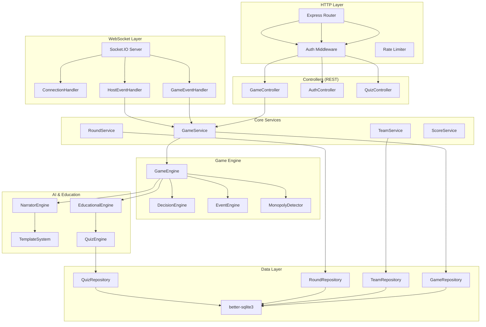
```mermaid
graph TB
    subgraph "HTTP Layer"
        ROUTER["Express Router"]
        AUTH_MW["Auth Middleware"]
        RATE["Rate Limiter"]
    end

    subgraph "Controllers (REST)"
        GAME_CTRL["GameController"]
        AUTH_CTRL["AuthController"]
        QUIZ_CTRL["QuizController"]
    end

    subgraph "WebSocket Layer"
        IO["Socket.IO Server"]
        CONN_HANDLER["ConnectionHandler"]
        GAME_HANDLER["GameEventHandler"]
        HOST_HANDLER["HostEventHandler"]
    end

    subgraph "Core Services"
        GAME_SVC["GameService"]
        TEAM_SVC["TeamService"]
        ROUND_SVC["RoundService"]
        SCORE_SVC["ScoreService"]
    end

    subgraph "Game Engine"
        ENGINE["GameEngine"]
        DECISION_ENG["DecisionEngine"]
        EVENT_ENG["EventEngine"]
        MONOPOLY_DET["MonopolyDetector"]
    end

    subgraph "AI & Education"
        NARRATOR_ENG["NarratorEngine"]
        TEMPLATE_SYS["TemplateSystem"]
        EDU_ENGINE["EducationalEngine"]
        QUIZ_ENG["QuizEngine"]
    end

    subgraph "Data Layer"
        REPO_GAME["GameRepository"]
        REPO_TEAM["TeamRepository"]
        REPO_ROUND["RoundRepository"]
        REPO_QUIZ["QuizRepository"]
        DB["better-sqlite3"]
    end

    ROUTER --> AUTH_MW --> GAME_CTRL
    ROUTER --> AUTH_MW --> AUTH_CTRL
    ROUTER --> AUTH_MW --> QUIZ_CTRL

    IO --> CONN_HANDLER
    IO --> GAME_HANDLER
    IO --> HOST_HANDLER

    GAME_CTRL --> GAME_SVC
    GAME_HANDLER --> GAME_SVC
    HOST_HANDLER --> GAME_SVC

    GAME_SVC --> ENGINE
    ENGINE --> DECISION_ENG
    ENGINE --> EVENT_ENG
    ENGINE --> MONOPOLY_DET
    ENGINE --> NARRATOR_ENG
    ENGINE --> EDU_ENGINE

    NARRATOR_ENG --> TEMPLATE_SYS
    EDU_ENGINE --> QUIZ_ENG

    GAME_SVC --> REPO_GAME
    TEAM_SVC --> REPO_TEAM
    ROUND_SVC --> REPO_ROUND
    QUIZ_ENG --> REPO_QUIZ

    REPO_GAME --> DB
    REPO_TEAM --> DB
    REPO_ROUND --> DB
    REPO_QUIZ --> DB
```

### 3.2 Folder Breakdown

```
server/
├── src/
│   ├── index.ts                    # Entry point: Express + Socket.IO init
│   ├── config/
│   │   ├── index.ts                # Centralized config from env vars
│   │   ├── database.ts             # SQLite connection setup
│   │   └── socket.ts               # Socket.IO server config
│   ├── middleware/
│   │   ├── auth.middleware.ts       # Host PIN + session validation
│   │   ├── rate-limit.middleware.ts # Rate limiter
│   │   └── error.middleware.ts      # Global error handler
│   ├── controllers/
│   │   ├── game.controller.ts       # POST /games, GET /games/:id
│   │   ├── auth.controller.ts       # POST /auth/host, POST /auth/join
│   │   └── quiz.controller.ts       # GET /quizzes, POST /quizzes/answer
│   ├── services/
│   │   ├── game.service.ts          # Game session CRUD + orchestration
│   │   ├── team.service.ts          # Team registration + stats
│   │   ├── round.service.ts         # Round progression logic
│   │   └── score.service.ts         # Score calculation + leaderboard
│   ├── socket/
│   │   ├── index.ts                 # Socket.IO setup + namespace
│   │   ├── connection.handler.ts    # Join, disconnect, reconnect
│   │   ├── game-event.handler.ts    # Decision submission, round events
│   │   └── host-event.handler.ts    # Host controls: start, pause, trigger
│   ├── engine/
│   │   ├── game.engine.ts           # Core game loop orchestrator
│   │   ├── decision.engine.ts       # Decision processing + effects
│   │   ├── event.engine.ts          # Random event generation + effects
│   │   ├── monopoly-detector.ts     # Monopoly condition checking
│   │   └── scoring.engine.ts        # Point calculation formulas
│   ├── narrator/
│   │   ├── narrator.engine.ts       # Template selection + variable injection
│   │   ├── template.system.ts       # Template registry + lookup
│   │   └── templates/
│   │       ├── decisions.json       # Decision-related narrations
│   │       ├── events.json          # Random event narrations
│   │       ├── monopoly.json        # Monopoly explanation narrations
│   │       ├── education.json       # Educational concept narrations
│   │       └── round-summary.json   # End-of-round summary narrations
│   ├── education/
│   │   ├── education.engine.ts      # Educational content orchestrator
│   │   ├── quiz.engine.ts           # Quiz question selection + scoring
│   │   └── data/
│   │       ├── quizzes.json         # Quiz question bank
│   │       └── concepts.json        # Economic concept definitions
│   ├── repositories/
│   │   ├── game.repository.ts       # Game table operations
│   │   ├── team.repository.ts       # Team table operations
│   │   ├── round.repository.ts      # Round + decision log operations
│   │   └── quiz.repository.ts       # Quiz result operations
│   ├── types/
│   │   ├── game.types.ts            # Game, Round, Decision types
│   │   ├── team.types.ts            # Team, Player types
│   │   ├── socket.types.ts          # Socket event payload types
│   │   ├── narrator.types.ts        # Template, Narration types
│   │   └── quiz.types.ts            # Quiz, Question types
│   └── utils/
│       ├── random.ts                # Seeded RNG for reproducible randomness
│       ├── room-code.ts             # 6-char room code generator
│       └── logger.ts                # Structured logging (pino)
```

### 3.3 Controller Endpoints

| Method | Path | Purpose | Auth |
|---|---|---|---|
| `POST` | `/api/auth/host` | Authenticate host with PIN | None |
| `POST` | `/api/auth/join` | Player joins with room code | None |
| `POST` | `/api/games` | Create new game session | Host |
| `GET` | `/api/games/:id` | Get game state | Session |
| `GET` | `/api/games/:id/results` | Get final results | Session |
| `GET` | `/api/quizzes/bank` | List available quiz packs | Host |

### 3.4 Service Layer Responsibilities

| Service | Methods | Purpose |
|---|---|---|
| `GameService` | `create()`, `join()`, `start()`, `getState()`, `endGame()` | Game session lifecycle |
| `TeamService` | `register()`, `getStats()`, `updateStats()`, `getAll()` | Team data management |
| `RoundService` | `startRound()`, `processDecisions()`, `endRound()`, `getHistory()` | Round progression |
| `ScoreService` | `calculateRoundScore()`, `getLeaderboard()`, `getFinalRanking()` | Scoring + ranking |

---

## 4. Database Schema

### 4.1 Entity-Relationship Diagram

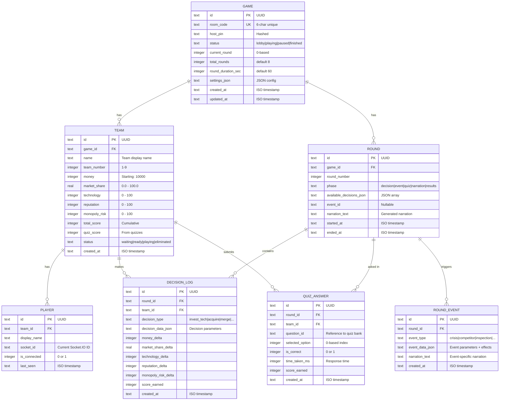
```mermaid
erDiagram
    GAME ||--o{ TEAM : has
    GAME ||--o{ ROUND : has
    TEAM ||--o{ PLAYER : has
    TEAM ||--o{ DECISION_LOG : makes
    ROUND ||--o{ DECISION_LOG : contains
    ROUND ||--o{ ROUND_EVENT : triggers
    TEAM ||--o{ QUIZ_ANSWER : submits
    ROUND ||--o{ QUIZ_ANSWER : "asked in"

    GAME {
        text id PK "UUID"
        text room_code UK "6-char unique"
        text host_pin "Hashed"
        text status "lobby|playing|paused|finished"
        integer current_round "0-based"
        integer total_rounds "default 8"
        integer round_duration_sec "default 60"
        text settings_json "JSON config"
        text created_at "ISO timestamp"
        text updated_at "ISO timestamp"
    }

    TEAM {
        text id PK "UUID"
        text game_id FK
        text name "Team display name"
        integer team_number "1-9"
        integer money "Starting: 10000"
        real market_share "0.0 - 100.0"
        integer technology "0 - 100"
        integer reputation "0 - 100"
        integer monopoly_risk "0 - 100"
        integer total_score "Cumulative"
        integer quiz_score "From quizzes"
        text status "waiting|ready|playing|eliminated"
        text created_at "ISO timestamp"
    }

    PLAYER {
        text id PK "UUID"
        text team_id FK
        text display_name
        text socket_id "Current Socket.IO ID"
        integer is_connected "0 or 1"
        text last_seen "ISO timestamp"
    }

    ROUND {
        text id PK "UUID"
        text game_id FK
        integer round_number
        text phase "decision|event|quiz|narration|results"
        text available_decisions_json "JSON array"
        text event_id "Nullable"
        text narration_text "Generated narration"
        text started_at "ISO timestamp"
        text ended_at "ISO timestamp"
    }

    DECISION_LOG {
        text id PK "UUID"
        text round_id FK
        text team_id FK
        text decision_type "invest_tech|acquire|merge|..."
        text decision_data_json "Decision parameters"
        integer money_delta
        real market_share_delta
        integer technology_delta
        integer reputation_delta
        integer monopoly_risk_delta
        integer score_earned
        text created_at "ISO timestamp"
    }

    ROUND_EVENT {
        text id PK "UUID"
        text round_id FK
        text event_type "crisis|competitor|inspection|..."
        text event_data_json "Event parameters + effects"
        text narration_text "Event-specific narration"
        text created_at "ISO timestamp"
    }

    QUIZ_ANSWER {
        text id PK "UUID"
        text round_id FK
        text team_id FK
        text question_id "Reference to quiz bank"
        integer selected_option "0-based index"
        integer is_correct "0 or 1"
        integer time_taken_ms "Response time"
        integer score_earned
        text created_at "ISO timestamp"
    }
```

### 4.2 Table Details & Indexes

| Table | Index Name | Columns | Type |
|---|---|---|---|
| `game` | `idx_game_room_code` | `room_code` | UNIQUE |
| `game` | `idx_game_status` | `status` | NORMAL |
| `team` | `idx_team_game_id` | `game_id` | NORMAL |
| `team` | `idx_team_game_number` | `game_id, team_number` | UNIQUE |
| `player` | `idx_player_team_id` | `team_id` | NORMAL |
| `player` | `idx_player_socket` | `socket_id` | NORMAL |
| `decision_log` | `idx_decision_round_team` | `round_id, team_id` | UNIQUE |
| `round` | `idx_round_game` | `game_id, round_number` | UNIQUE |
| `quiz_answer` | `idx_quiz_round_team` | `round_id, team_id` | UNIQUE |
| `round_event` | `idx_event_round` | `round_id` | NORMAL |

### 4.3 SQLite Pragmas

```sql
PRAGMA journal_mode = WAL;          -- Better concurrent read performance
PRAGMA synchronous = NORMAL;        -- Balance safety and speed
PRAGMA foreign_keys = ON;           -- Enforce referential integrity
PRAGMA busy_timeout = 5000;         -- 5s wait on lock contention
```

---

## 5. Socket.IO Event Flow

### 5.1 Connection Lifecycle

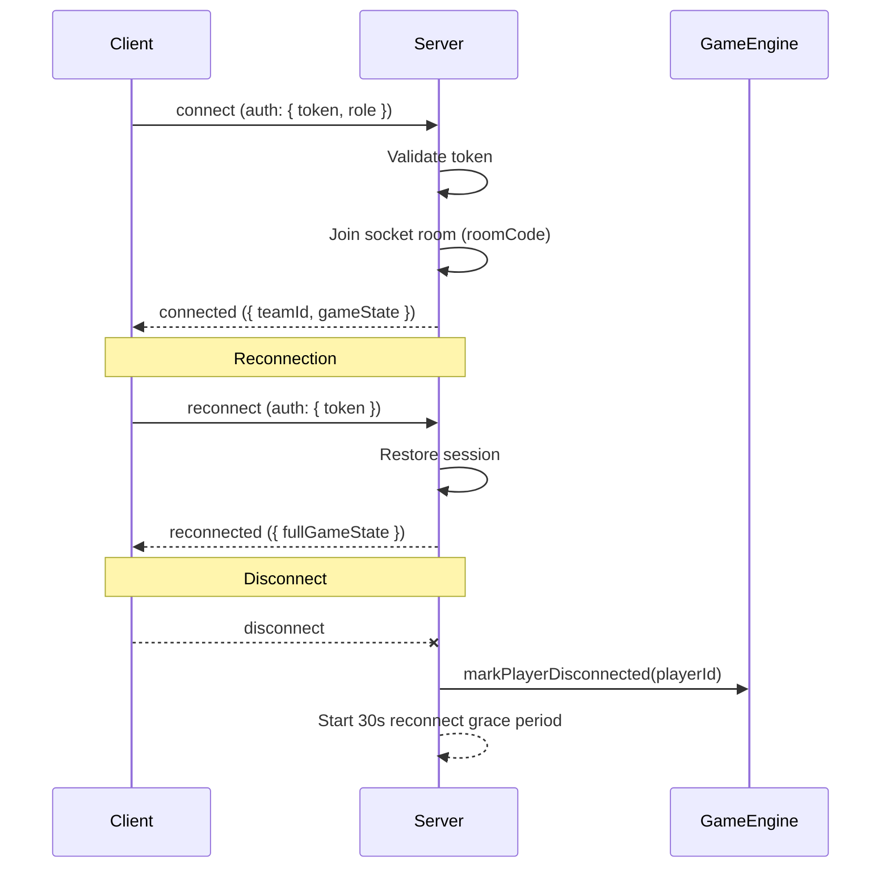
```mermaid
sequenceDiagram
    participant C as Client
    participant S as Server
    participant E as GameEngine

    C->>S: connect (auth: { token, role })
    S->>S: Validate token
    S->>S: Join socket room (roomCode)
    S-->>C: connected ({ teamId, gameState })

    Note over C,S: Reconnection
    C->>S: reconnect (auth: { token })
    S->>S: Restore session
    S-->>C: reconnected ({ fullGameState })

    Note over C,S: Disconnect
    C--xS: disconnect
    S->>E: markPlayerDisconnected(playerId)
    S-->>S: Start 30s reconnect grace period
```

### 5.2 Complete Event Table

#### Client → Server Events

| Event Name | Sender | Payload | Description |
|---|---|---|---|
| `player:join` | Player | `{ roomCode, teamName, playerName }` | Request to join a game room |
| `player:ready` | Player | `{ teamId }` | Mark team as ready in lobby |
| `player:decision` | Player | `{ roundId, teamId, decisionType }` | Submit a business decision |
| `player:quiz-answer` | Player | `{ roundId, teamId, questionId, selectedOption, timeTakenMs }` | Submit quiz answer |
| `host:create-game` | Host | `{ totalRounds, roundDuration, quizEnabled }` | Create game session |
| `host:start-game` | Host | `{ gameId }` | Start the game from lobby |
| `host:next-phase` | Host | `{ gameId }` | Manually advance to next phase |
| `host:trigger-event` | Host | `{ gameId, eventType? }` | Force a random event |
| `host:pause` | Host | `{ gameId }` | Pause the game |
| `host:resume` | Host | `{ gameId }` | Resume the game |
| `host:kick-team` | Host | `{ gameId, teamId }` | Remove team from game |
| `projector:join` | Projector | `{ roomCode }` | Join as projector display |

#### Server → Client Events

| Event Name | Target | Payload | Description |
|---|---|---|---|
| `game:state-sync` | All | `{ fullGameState }` | Full state synchronization |
| `game:phase-change` | All | `{ phase, roundNumber, data }` | Phase transition notification |
| `game:countdown` | All | `{ seconds }` | Pre-game countdown |
| `round:start` | All | `{ roundNumber, decisions[], timeLimit }` | New round begins |
| `round:tick` | All | `{ timeLeft }` | Timer update (every 5s) |
| `round:decision-received` | Team | `{ teamId, confirmed: true }` | Ack decision submission |
| `round:results` | All | `{ teamResults[], marketState }` | Round outcome for all teams |
| `event:triggered` | All | `{ eventType, title, description, effects }` | Random event notification |
| `narrator:message` | All | `{ text, type, relatedConcept? }` | AI narrator message |
| `quiz:start` | All | `{ question, options[], timeLimit }` | Quiz question broadcast |
| `quiz:results` | All | `{ correctAnswer, teamScores[], explanation }` | Quiz outcome |
| `team:joined` | All | `{ teamId, teamName, teamCount }` | Team joined lobby |
| `team:ready` | All | `{ teamId, readyCount, totalCount }` | Team marked ready |
| `team:stats-update` | Team | `{ money, marketShare, tech, reputation, monopolyRisk }` | Private stats update |
| `monopoly:detected` | All | `{ teamId, teamName, explanation }` | Monopoly condition met |
| `game:over` | All | `{ finalLeaderboard[], gameStats }` | Game ended |
| `error` | Sender | `{ code, message }` | Error notification |

### 5.3 Event Flow — One Complete Round

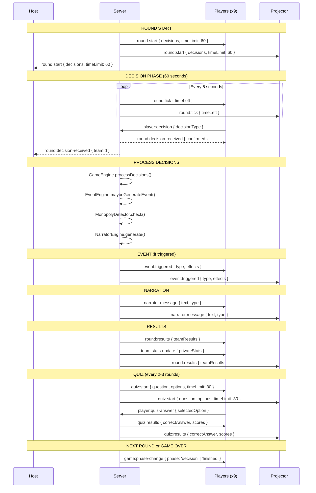
```mermaid
sequenceDiagram
    participant H as Host
    participant S as Server
    participant P as Players (x9)
    participant PR as Projector

    Note over H,PR: ROUND START
    S->>P: round:start { decisions, timeLimit: 60 }
    S->>PR: round:start { decisions, timeLimit: 60 }
    S->>H: round:start { decisions, timeLimit: 60 }

    Note over H,PR: DECISION PHASE (60 seconds)
    loop Every 5 seconds
        S->>P: round:tick { timeLeft }
        S->>PR: round:tick { timeLeft }
    end

    P->>S: player:decision { decisionType }
    S-->>P: round:decision-received { confirmed }
    S-->>H: round:decision-received { teamId }

    Note over H,PR: PROCESS DECISIONS
    S->>S: GameEngine.processDecisions()
    S->>S: EventEngine.maybeGenerateEvent()
    S->>S: MonopolyDetector.check()
    S->>S: NarratorEngine.generate()

    Note over H,PR: EVENT (if triggered)
    S->>P: event:triggered { type, effects }
    S->>PR: event:triggered { type, effects }

    Note over H,PR: NARRATION
    S->>P: narrator:message { text, type }
    S->>PR: narrator:message { text, type }

    Note over H,PR: RESULTS
    S->>P: round:results { teamResults }
    S->>P: team:stats-update { privateStats }
    S->>PR: round:results { teamResults }

    Note over H,PR: QUIZ (every 2-3 rounds)
    S->>P: quiz:start { question, options, timeLimit: 30 }
    S->>PR: quiz:start { question, options, timeLimit: 30 }
    P->>S: player:quiz-answer { selectedOption }
    S->>P: quiz:results { correctAnswer, scores }
    S->>PR: quiz:results { correctAnswer, scores }

    Note over H,PR: NEXT ROUND or GAME OVER
    S->>P: game:phase-change { phase: 'decision' | 'finished' }
```

---

## 6. Game Lifecycle

### 6.1 State Machine

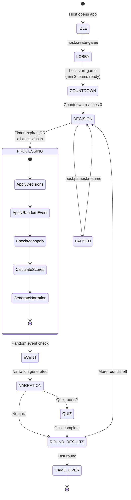
```mermaid
stateDiagram-v2
    [*] --> IDLE: Host opens app
    IDLE --> LOBBY: host:create-game
    LOBBY --> COUNTDOWN: host:start-game<br/>(min 2 teams ready)
    COUNTDOWN --> DECISION: Countdown reaches 0
    DECISION --> PROCESSING: Timer expires OR<br/>all decisions in
    PROCESSING --> EVENT: Random event check
    EVENT --> NARRATION: Narration generated
    NARRATION --> QUIZ: Quiz round?
    NARRATION --> ROUND_RESULTS: No quiz
    QUIZ --> ROUND_RESULTS: Quiz complete
    ROUND_RESULTS --> DECISION: More rounds left
    ROUND_RESULTS --> GAME_OVER: Last round
    GAME_OVER --> [*]

    DECISION --> PAUSED: host:pause
    PAUSED --> DECISION: host:resume

    state PROCESSING {
        [*] --> ApplyDecisions
        ApplyDecisions --> ApplyRandomEvent
        ApplyRandomEvent --> CheckMonopoly
        CheckMonopoly --> CalculateScores
        CalculateScores --> GenerateNarration
        GenerateNarration --> [*]
    }
```

### 6.2 Phase Details

| Phase | Duration | Player Action | Host Action | Projector Shows |
|---|---|---|---|---|
| **IDLE** | — | — | Opens host page | — |
| **LOBBY** | Until start | Join + Ready | Monitor, Start | QR code, team list |
| **COUNTDOWN** | 5 seconds | Watch | Watch | 5-4-3-2-1 animation |
| **DECISION** | 60s (configurable) | Select 1 decision | Monitor submissions | Timer + decision stats |
| **PROCESSING** | 2-3s | Wait animation | View processing | Loading animation |
| **EVENT** | 5s | View event | View event | Event card animation |
| **NARRATION** | 5-8s | Read narration | Read narration | Narration display |
| **QUIZ** | 30s | Answer question | View responses | Question + timer |
| **ROUND_RESULTS** | 8s | View stats changes | View leaderboard | Leaderboard animation |
| **GAME_OVER** | — | View final rank | View summary | Top 3 + stats |

### 6.3 Round Scheduling

```
Total default rounds: 8

Quiz schedule: Rounds 3, 5, 7 (every 2 rounds starting from round 3)

Random event probability per round: 60%

Monopoly check: Every round after processing

Round structure:
  [Decision 60s] → [Processing 3s] → [Event 5s?] → [Narration 6s] → [Quiz 30s?] → [Results 8s]

Estimated game duration:
  8 rounds × ~100s average = ~13-15 minutes total
```

---

## 7. Game Engine Architecture

### 7.1 Engine Class Diagram

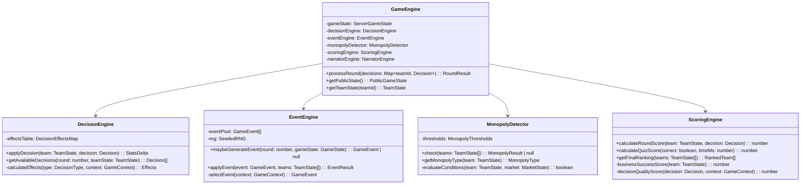
```mermaid
classDiagram
    class GameEngine {
        -gameState: ServerGameState
        -decisionEngine: DecisionEngine
        -eventEngine: EventEngine
        -monopolyDetector: MonopolyDetector
        -scoringEngine: ScoringEngine
        -narratorEngine: NarratorEngine
        +processRound(decisions: Map~teamId, Decision~): RoundResult
        +getPublicState(): PublicGameState
        +getTeamState(teamId): TeamState
    }

    class DecisionEngine {
        -effectsTable: DecisionEffectsMap
        +applyDecision(team: TeamState, decision: Decision): StatsDelta
        +getAvailableDecisions(round: number, teamState: TeamState): Decision[]
        -calculateEffects(type: DecisionType, context: GameContext): Effects
    }

    class EventEngine {
        -eventPool: GameEvent[]
        -rng: SeededRNG
        +maybeGenerateEvent(round: number, gameState: GameState): GameEvent | null
        +applyEvent(event: GameEvent, teams: TeamState[]): EventResult
        -selectEvent(context: GameContext): GameEvent
    }

    class MonopolyDetector {
        -thresholds: MonopolyThresholds
        +check(teams: TeamState[]): MonopolyResult | null
        +getMonopolyType(team: TeamState): MonopolyType
        -evaluateConditions(team: TeamState, market: MarketState): boolean
    }

    class ScoringEngine {
        +calculateRoundScore(team: TeamState, decision: Decision): number
        +calculateQuizScore(correct: boolean, timeMs: number): number
        +getFinalRanking(teams: TeamState[]): RankedTeam[]
        -businessSuccessScore(team: TeamState): number
        -decisionQualityScore(decision: Decision, context: GameContext): number
    }

    GameEngine --> DecisionEngine
    GameEngine --> EventEngine
    GameEngine --> MonopolyDetector
    GameEngine --> ScoringEngine
```

### 7.2 Decision Effects Table

| Decision | Money | Market Share | Technology | Reputation | Monopoly Risk |
|---|---|---|---|---|---|
| **Invest in Technology** | -2000 | +1% | +15 | +5 | +2 |
| **Acquire Competitors** | -5000 | +8% | +3 | -10 | +20 |
| **Merge Companies** | -3000 | +12% | +5 | -5 | +25 |
| **Reduce Prices** | -1500 | +5% | 0 | +15 | +5 |
| **Expand Factories** | -4000 | +4% | +5 | +5 | +8 |
| **Accept Gov Support** | +3000 | +2% | +5 | -5 | +15 |
| **Lobby Government** | -2000 | +3% | 0 | -15 | +18 |
| **Export** | -1000 | +3% | +5 | +10 | +3 |
| **Raise Prices** | +4000 | -3% | 0 | -10 | +10 |

> **Note:** These are base values. Actual effects are modified by:  
> - Current team stats (diminishing returns at high levels)  
> - Active random events (economic crisis reduces all gains by 50%)  
> - Round number (later rounds have higher stakes)  
> - Other teams' decisions (if 3+ teams expand, market share gains are diluted)

### 7.3 Decision Availability Logic

```
Available decisions per round: 4-6 (randomly selected from pool)

Decisions are filtered by:
  - Team money (can't acquire if money < 5000)
  - Current market share (can't merge if share < 10%)
  - Previous decisions (can't repeat same decision 2 rounds in a row)
  - Round number (Lobby, Gov Support available from round 3+)

Each team sees the SAME set of available decisions per round.
This ensures fairness while maintaining strategic depth.
```

### 7.4 Random Event System

| Event | Probability | Effect Scope | Money | Market | Tech | Reputation | Monopoly Risk |
|---|---|---|---|---|---|---|---|
| **Economic Crisis** | 15% | All teams | -2000 | -3% | 0 | 0 | -5 |
| **New Competitor** | 15% | All teams | 0 | -2% | 0 | 0 | -8 |
| **Gov Inspection** | 10% | Top monopoly-risk team | -3000 | -5% | 0 | -10 | -15 |
| **Labor Strike** | 10% | Random 3 teams | -1500 | -2% | 0 | -10 | 0 |
| **Tech Breakthrough** | 10% | All teams | 0 | 0 | +10 | +5 | 0 |
| **Foreign Investment** | 15% | Random 3 teams | +3000 | +2% | +5 | +5 | +3 |
| **Natural Disaster** | 10% | All teams | -3000 | -4% | -5 | 0 | 0 |
| **Trade Agreement** | 10% | All teams | +1000 | +1% | +3 | +5 | +2 |
| **Consumer Boycott** | 5% | Lowest reputation team | -1000 | -5% | 0 | -15 | -5 |

### 7.5 Monopoly Detection

```
A team reaches "monopoly conditions" when ANY of these are true:

1. MARKET DOMINANCE:
   market_share >= 50%

2. MONOPOLY RISK CEILING:
   monopoly_risk >= 80

3. COMBINED DOMINANCE:
   market_share >= 35% AND monopoly_risk >= 60

4. RELATIVE DOMINANCE:
   market_share >= 3x the average of all other teams

When detected:
  → Game does NOT end
  → AI Narrator delivers educational explanation
  → Government intervention event is forced
  → Team's monopoly_risk is reduced by 20
  → Team's market_share is reduced by 10%
  → Other teams receive a small boost (+5% market share each)
  → This simulates real-world anti-trust regulation
```

### 7.6 Scoring Formulas

```
ROUND SCORE = Business Score + Decision Quality Score

Business Score:
  = (money / 1000) + (market_share × 2) + (technology × 0.5) + (reputation × 0.5)
  Range: ~0 - 50 per round

Decision Quality Score:
  Based on how "optimal" the decision was given context:
  - Investing in tech when tech is low: +10 bonus
  - Reducing prices during economic crisis: +8 bonus
  - Lobbying when reputation is low: -5 penalty
  Range: -5 to +15 per round

Quiz Score:
  Correct answer: 20 points
  Speed bonus: max(0, (timeLimit - timeTaken) / timeLimit × 10) → 0-10 extra points
  Range: 0 - 30 per quiz

FINAL SCORE = Σ(Round Scores) + Σ(Quiz Scores)
```

### 7.7 Randomness Architecture

```
Seeded RNG:
  - Use a deterministic pseudo-random number generator (e.g., seedrandom)
  - Game seed is generated at game creation time
  - Seed is stored in the game record
  - This ensures reproducibility for debugging and replay

Random elements:
  1. Available decisions per round → shuffled from pool, seeded
  2. Random events → probability check per round, seeded
  3. Event target selection → random team selection, seeded
  4. Foreign investment recipient → random team selection, seeded

Non-random elements:
  1. Decision effects → deterministic formulas
  2. Scoring → deterministic formulas
  3. Monopoly detection → deterministic thresholds
  4. Quiz questions → sequential from quiz bank (not random)
```

---

## 8. Educational Engine

### 8.1 Concept Mapping

The game mechanics directly map to Political Economics concepts:

| Game Mechanic | Economic Concept | When Taught |
|---|---|---|
| Acquiring competitors | Capital concentration (tập trung tư bản) | When a team acquires |
| Merging companies | Capital centralization (tích tụ tư bản) | When a team merges |
| Market share > 50% | Monopoly formation (hình thành độc quyền) | Monopoly detection |
| Government inspection event | State regulation of monopoly | Event triggers |
| Accept government support | State monopoly capitalism (CNTB độc quyền nhà nước) | Decision made |
| Lobby government | Relationship between monopoly and state | Decision made |
| Electric/Water industry quiz | Why Vietnam keeps state control | Quiz rounds |
| Raise prices (high market share) | Monopoly pricing power | Narration |
| Economic crisis affecting all | Inherent contradictions of capitalism | Event triggers |
| Foreign investment | International monopoly / Imperialism | Event triggers |

### 8.2 Educational Content Insertion Points

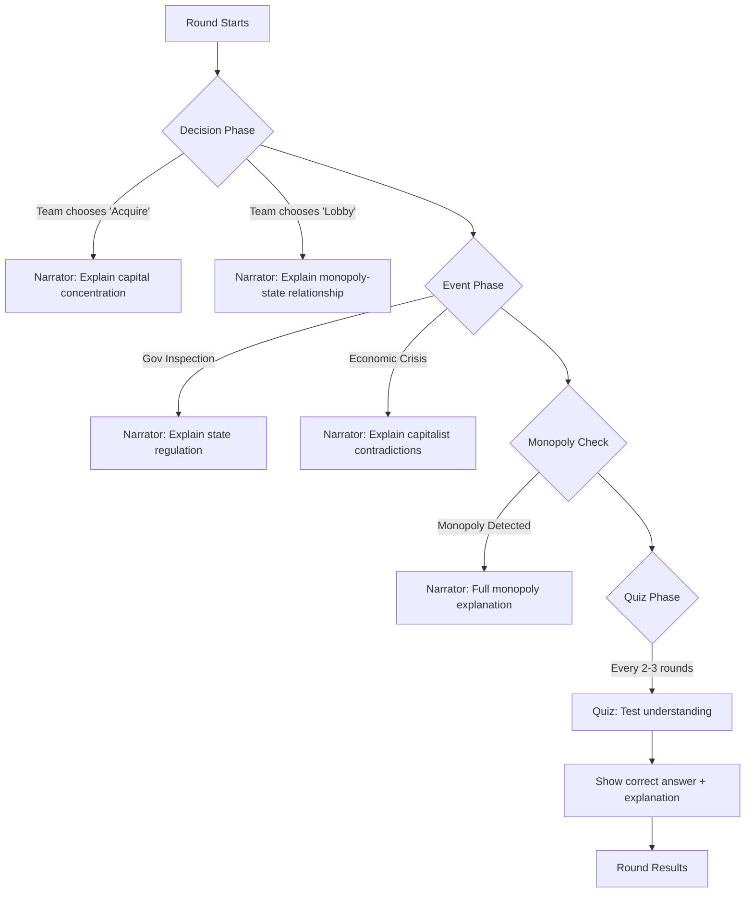
```mermaid
graph TD
    A[Round Starts] --> B{Decision Phase}
    B -->|Team chooses 'Acquire'| C[Narrator: Explain capital concentration]
    B -->|Team chooses 'Lobby'| D[Narrator: Explain monopoly-state relationship]
    B --> E{Event Phase}
    E -->|Gov Inspection| F[Narrator: Explain state regulation]
    E -->|Economic Crisis| G[Narrator: Explain capitalist contradictions]
    E --> H{Monopoly Check}
    H -->|Monopoly Detected| I[Narrator: Full monopoly explanation]
    H --> J{Quiz Phase}
    J -->|Every 2-3 rounds| K[Quiz: Test understanding]
    K --> L[Show correct answer + explanation]
    L --> M[Round Results]
```

### 8.3 Quiz Engine

```
Quiz bank structure:
  - 15-20 questions total
  - 3-4 questions used per game (rounds 3, 5, 7)
  - Questions ordered by difficulty (easy → hard)
  - Each question maps to a concept that was demonstrated in recent rounds

Question categories:
  1. MONOPOLY_DEFINITION     — "What is monopoly?"
  2. MONOPOLY_CAUSES         — "What causes monopoly formation?"
  3. STATE_MONOPOLY          — "What is state monopoly capitalism?"
  4. VIETNAM_CONTEXT         — "Why doesn't Vietnam privatize electricity/water?"
  5. CAPITAL_CONCENTRATION   — "What is capital concentration?"
  6. CAPITAL_CENTRALIZATION  — "What is capital centralization?"

Question format:
  {
    "id": "q_001",
    "category": "MONOPOLY_DEFINITION",
    "question": "Dựa vào trải nghiệm trong game, độc quyền xảy ra khi nào?",
    "options": [
      "Khi một công ty chiếm hơn 50% thị phần",
      "Khi tất cả các công ty có lợi nhuận cao",
      "Khi chính phủ hỗ trợ mọi doanh nghiệp",
      "Khi có nhiều đối thủ cạnh tranh"
    ],
    "correctIndex": 0,
    "explanation": "Độc quyền hình thành khi một hoặc một nhóm nhỏ doanh nghiệp kiểm soát phần lớn thị trường, loại bỏ cạnh tranh. Trong game, bạn đã thấy điều này khi một đội chiếm hơn 50% thị phần.",
    "relatedConcept": "MONOPOLY_DEFINITION",
    "difficulty": 1
  }

Quiz selection logic:
  - Round 3: 1 easy question about what just happened in game
  - Round 5: 1 medium question connecting game events to theory
  - Round 7: 1 hard question about Vietnam context / state monopoly
```

### 8.4 Concept Explanations (Displayed After Quiz or Monopoly Detection)

| Concept | Vietnamese Explanation (Summary) | Trigger |
|---|---|---|
| Monopoly (Độc quyền) | Tình trạng một doanh nghiệp hoặc nhóm nhỏ doanh nghiệp kiểm soát toàn bộ thị trường | Market share ≥ 50% |
| Capital Concentration | Tập trung tư bản: tích lũy vốn thông qua giá trị thặng dư | Team acquires competitors |
| Capital Centralization | Tích tụ tư bản: sáp nhập các tư bản nhỏ thành tư bản lớn | Team merges |
| State Monopoly Capitalism | CNTB độc quyền nhà nước: sự kết hợp giữa nhà nước và độc quyền tư nhân | Gov support + high monopoly |
| Vietnam's State Sectors | Điện, nước là ngành thiết yếu. Tư nhân hóa hoàn toàn sẽ dẫn đến độc quyền tư nhân, gây hại cho người dân | Quiz round 7 |

---

## 9. AI Narrator Architecture

### 9.1 Template System Design

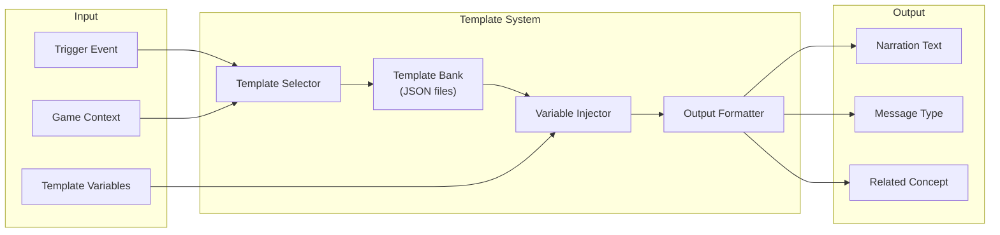
```mermaid
graph LR
    subgraph "Input"
        TRIGGER["Trigger Event"]
        CONTEXT["Game Context"]
        VARS["Template Variables"]
    end

    subgraph "Template System"
        SELECTOR["Template Selector"]
        BANK["Template Bank<br/>(JSON files)"]
        INJECTOR["Variable Injector"]
        FORMATTER["Output Formatter"]
    end

    subgraph "Output"
        NARRATION["Narration Text"]
        TYPE["Message Type"]
        CONCEPT["Related Concept"]
    end

    TRIGGER --> SELECTOR
    CONTEXT --> SELECTOR
    SELECTOR --> BANK
    BANK --> INJECTOR
    VARS --> INJECTOR
    INJECTOR --> FORMATTER
    FORMATTER --> NARRATION
    FORMATTER --> TYPE
    FORMATTER --> CONCEPT
```

### 9.2 Template Categories

| Category | Trigger | Count | Example |
|---|---|---|---|
| `decision_acquire` | Team acquires | 4 variants | "Đội {teamName} vừa thâu tóm đối thủ..." |
| `decision_merge` | Team merges | 4 variants | "Sự sáp nhập này là ví dụ của tích tụ tư bản..." |
| `decision_lobby` | Team lobbies | 3 variants | "Đội {teamName} vận động chính phủ..." |
| `decision_tech` | Team invests | 3 variants | "Đầu tư công nghệ giúp nâng cao..." |
| `decision_price_raise` | Team raises prices | 3 variants | "Khi thị phần lớn, việc tăng giá..." |
| `decision_gov_support` | Team takes gov aid | 3 variants | "Sự hỗ trợ của nhà nước cho thấy..." |
| `event_crisis` | Economic crisis | 3 variants | "Khủng hoảng kinh tế cho thấy..." |
| `event_inspection` | Gov inspection | 3 variants | "Chính phủ điều tra khi độc quyền..." |
| `event_competitor` | New competitor | 3 variants | "Đối thủ mới xuất hiện, cạnh tranh..." |
| `monopoly_detected` | Monopoly reached | 4 variants | "Đội {teamName} đã đạt vị thế độc quyền!" |
| `monopoly_broken` | Gov intervention | 3 variants | "Chính phủ can thiệp để phá vỡ..." |
| `round_summary` | End of round | 5 variants | "Sau vòng {round}, thị trường..." |
| `game_over` | Game ends | 3 variants | "Trò chơi kết thúc. Hãy nhìn lại..." |

### 9.3 Template Structure

```json
{
  "category": "decision_acquire",
  "templates": [
    {
      "id": "acq_001",
      "text": "Đội {teamName} vừa thâu tóm đối thủ cạnh tranh. Thị phần tăng lên {marketShare}%. Đây là ví dụ điển hình của quá trình tập trung tư bản — khi các doanh nghiệp lớn nuốt chửng doanh nghiệp nhỏ.",
      "conditions": {
        "minMarketShare": 0,
        "maxMarketShare": 30
      },
      "type": "education",
      "relatedConcept": "CAPITAL_CONCENTRATION"
    },
    {
      "id": "acq_002",
      "text": "⚠️ Đội {teamName} tiếp tục thâu tóm! Thị phần hiện tại: {marketShare}%. Khi một công ty kiểm soát phần lớn thị trường, người tiêu dùng sẽ mất quyền lựa chọn. Đây chính là mặt trái của độc quyền.",
      "conditions": {
        "minMarketShare": 30,
        "maxMarketShare": 100
      },
      "type": "warning",
      "relatedConcept": "MONOPOLY_DEFINITION"
    }
  ]
}
```

### 9.4 Template Variables

| Variable | Type | Source | Example |
|---|---|---|---|
| `{teamName}` | string | Team record | "Đội Alpha" |
| `{marketShare}` | number | Team stats | 45 |
| `{money}` | number | Team stats | 15000 |
| `{technology}` | number | Team stats | 72 |
| `{reputation}` | number | Team stats | 38 |
| `{monopolyRisk}` | number | Team stats | 65 |
| `{round}` | number | Game state | 5 |
| `{totalRounds}` | number | Game config | 8 |
| `{topTeam}` | string | Leaderboard | "Đội Beta" |
| `{eventName}` | string | Event data | "Khủng hoảng kinh tế" |
| `{industryName}` | string | Game config | "Công nghiệp điện" |

### 9.5 Template Selection Algorithm

```
1. Receive trigger (e.g., "decision_acquire" for Team A)
2. Load all templates in category "decision_acquire"
3. Filter by conditions:
   - Check team's marketShare against template's min/max
   - Check if template was used in last 2 rounds (avoid repetition)
4. From filtered list, pick randomly (seeded RNG)
5. Inject variables: replace {teamName}, {marketShare}, etc.
6. Return { text, type, relatedConcept }
```

---

## 10. Security

### 10.1 Threat Model

| Threat | Likelihood | Impact | Mitigation |
|---|---|---|---|
| Player submits multiple decisions | Medium | Medium | Server enforces 1 decision per team per round |
| Player modifies quiz answer | Medium | High | Answer validated server-side, time-locked |
| Player impersonates another team | Low | High | Session tokens bound to team ID |
| Duplicate login (same team) | Medium | Low | New connection replaces old socket |
| Host PIN brute force | Low | High | Rate limit + 6-digit PIN |
| WebSocket message spoofing | Low | Medium | Validate all payloads server-side |
| Direct DB manipulation | Very Low | Critical | SQLite file not exposed via web |

### 10.2 Authentication Flow

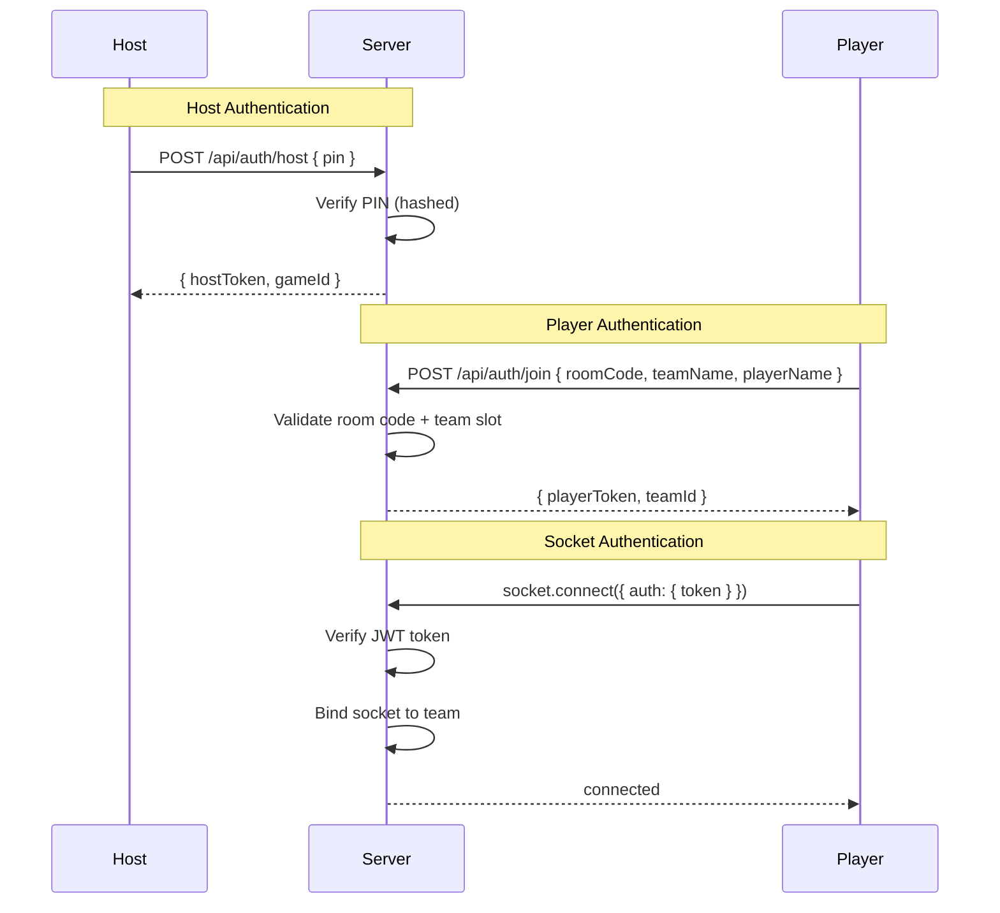
```mermaid
sequenceDiagram
    participant H as Host
    participant S as Server
    participant P as Player

    Note over H,S: Host Authentication
    H->>S: POST /api/auth/host { pin }
    S->>S: Verify PIN (hashed)
    S-->>H: { hostToken, gameId }

    Note over P,S: Player Authentication
    P->>S: POST /api/auth/join { roomCode, teamName, playerName }
    S->>S: Validate room code + team slot
    S-->>P: { playerToken, teamId }

    Note over P,S: Socket Authentication
    P->>S: socket.connect({ auth: { token } })
    S->>S: Verify JWT token
    S->>S: Bind socket to team
    S-->>P: connected
```

### 10.3 Security Implementation Details

```
Token System:
  - JWT tokens with short expiry (2 hours, sufficient for one game session)
  - Payload: { role, gameId, teamId?, playerId }
  - Secret from environment variable
  - Tokens validated on every Socket.IO event

Decision Validation:
  - Server tracks which teams have submitted decisions per round
  - Late submissions (after timer) are rejected
  - Decision type must be in the available decisions list for that round
  - Decision is immutable once submitted

Quiz Validation:
  - Answer window is server-timed (30 seconds)
  - Answers after window are rejected (score = 0)
  - timeTakenMs is verified against server's own timestamp
  - Answer index must be 0-3 (valid option range)

Rate Limiting:
  - REST endpoints: 30 requests per minute per IP
  - Socket events: 10 events per second per socket
  - Auth endpoints: 5 attempts per minute per IP

Duplicate Login Prevention:
  - When a new socket connects with the same teamId + playerId:
    → Old socket is forcibly disconnected
    → New socket takes over
    → This handles browser refresh / tab close gracefully

Host Authorization:
  - All host:* events check the socket's role === 'host'
  - Host token includes a special 'host' role claim
  - Only one host per game
```

---

## 11. Deployment Architecture

### 11.1 Server Architecture

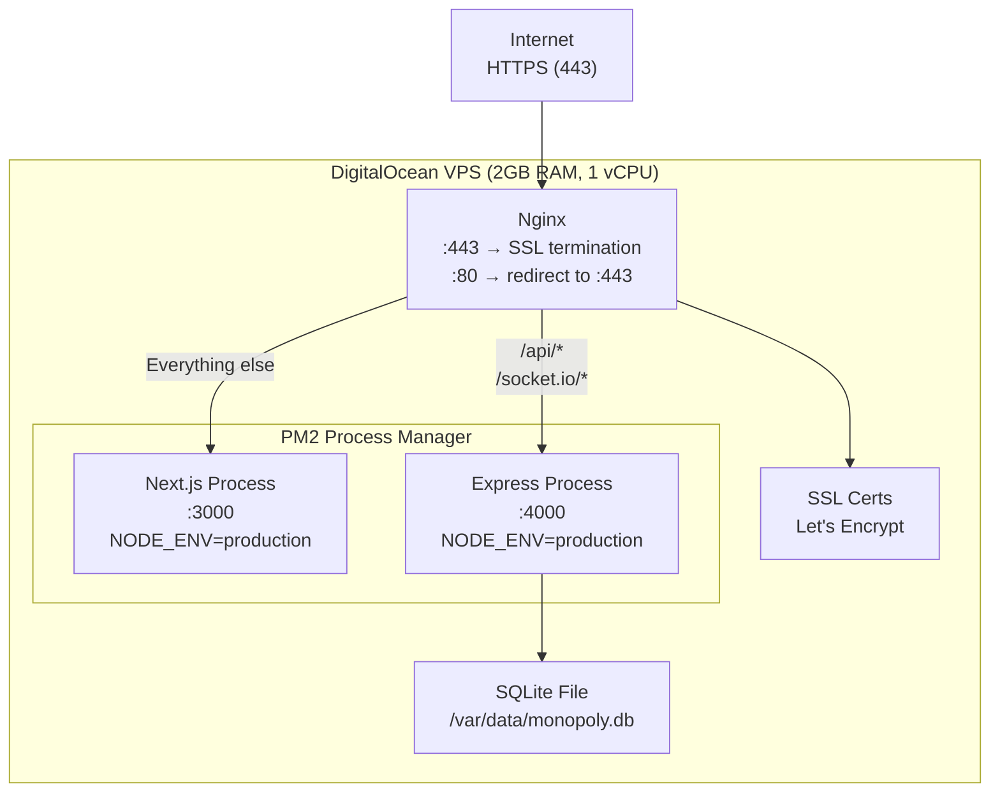
```mermaid
graph TB
    INTERNET["Internet<br/>HTTPS (443)"]

    subgraph "DigitalOcean VPS (2GB RAM, 1 vCPU)"
        NGINX["Nginx<br/>:443 → SSL termination<br/>:80 → redirect to :443"]

        subgraph "PM2 Process Manager"
            NEXT_PROC["Next.js Process<br/>:3000<br/>NODE_ENV=production"]
            EXPRESS_PROC["Express Process<br/>:4000<br/>NODE_ENV=production"]
        end

        SQLITE_FILE["SQLite File<br/>/var/data/monopoly.db"]
        CERTS["SSL Certs<br/>Let's Encrypt"]
    end

    INTERNET --> NGINX
    NGINX -->|/api/*<br/>/socket.io/*| EXPRESS_PROC
    NGINX -->|Everything else| NEXT_PROC
    EXPRESS_PROC --> SQLITE_FILE
    NGINX --> CERTS
```

### 11.2 Nginx Configuration (Summary)

```
server {
    listen 443 ssl http2;
    server_name monopolybattle.example.com;

    # SSL (Let's Encrypt via certbot)
    ssl_certificate     /etc/letsencrypt/live/.../fullchain.pem;
    ssl_certificate_key /etc/letsencrypt/live/.../privkey.pem;

    # Frontend (Next.js)
    location / {
        proxy_pass http://127.0.0.1:3000;
        proxy_http_version 1.1;
        proxy_set_header Upgrade $http_upgrade;
        proxy_set_header Connection 'upgrade';
        proxy_set_header Host $host;
    }

    # Backend API
    location /api/ {
        proxy_pass http://127.0.0.1:4000;
        proxy_set_header Host $host;
        proxy_set_header X-Real-IP $remote_addr;
    }

    # Socket.IO
    location /socket.io/ {
        proxy_pass http://127.0.0.1:4000;
        proxy_http_version 1.1;
        proxy_set_header Upgrade $http_upgrade;
        proxy_set_header Connection "upgrade";
        proxy_set_header Host $host;
        proxy_read_timeout 86400;     # 24 hours for WebSocket
    }
}

# HTTP → HTTPS redirect
server {
    listen 80;
    return 301 https://$server_name$request_uri;
}
```

### 11.3 PM2 Ecosystem Configuration

```
ecosystem.config.js:

  Frontend (Next.js):
    name: "monopoly-frontend"
    script: "npm"
    args: "start"
    cwd: "/var/www/monopoly/client"
    instances: 1
    max_memory_restart: "512M"

  Backend (Express):
    name: "monopoly-backend"
    script: "dist/index.js"
    cwd: "/var/www/monopoly/server"
    instances: 1
    max_memory_restart: "512M"
    env_production:
      NODE_ENV: production
      PORT: 4000
      DATABASE_PATH: /var/data/monopoly.db
      JWT_SECRET: <from env>
      HOST_PIN: <from env>
```

### 11.4 Environment Variables

| Variable | Required | Default | Description |
|---|---|---|---|
| `NODE_ENV` | Yes | `development` | `development` or `production` |
| `PORT` | No | `4000` | Express server port |
| `CLIENT_URL` | Yes | `http://localhost:3000` | Frontend URL for CORS |
| `DATABASE_PATH` | No | `./data/monopoly.db` | SQLite file path |
| `JWT_SECRET` | Yes | — | Secret key for JWT signing |
| `HOST_PIN` | Yes | — | 6-digit PIN for host auth |
| `GAME_SEED` | No | Random | Fixed seed for testing |

### 11.5 Deployment Checklist

```
1. Provision VPS:       DigitalOcean 2GB RAM / 1 vCPU / 50GB SSD
2. Install:             Node.js 20 LTS, Nginx, PM2, certbot
3. Clone repo:          /var/www/monopoly/
4. Build frontend:      cd client && npm run build
5. Build backend:       cd server && npm run build
6. Initialize DB:       npm run db:migrate
7. Configure Nginx:     /etc/nginx/sites-available/monopoly
8. SSL certificate:     certbot --nginx -d monopolybattle.example.com
9. Start PM2:           pm2 start ecosystem.config.js --env production
10. Save PM2:           pm2 save && pm2 startup
11. Test:               Access https://monopolybattle.example.com
```

---

## 12. Folder Structure

```
MonopolyBattle/
├── client/                              # Next.js Frontend
│   ├── public/
│   │   ├── fonts/
│   │   ├── images/
│   │   │   ├── logo.svg
│   │   │   └── icons/
│   │   └── sounds/                      # Optional: UI sound effects
│   ├── src/
│   │   ├── app/                         # Next.js App Router
│   │   │   ├── layout.tsx               # Root layout
│   │   │   ├── page.tsx                 # Landing page
│   │   │   ├── globals.css              # Global styles
│   │   │   ├── host/
│   │   │   │   ├── page.tsx             # Host dashboard
│   │   │   │   ├── lobby/
│   │   │   │   │   └── page.tsx         # Host lobby view
│   │   │   │   └── control/
│   │   │   │       └── page.tsx         # Host control panel
│   │   │   ├── play/
│   │   │   │   ├── join/
│   │   │   │   │   └── page.tsx         # Player join page
│   │   │   │   ├── lobby/
│   │   │   │   │   └── page.tsx         # Player waiting room
│   │   │   │   └── game/
│   │   │   │       └── page.tsx         # Main game page
│   │   │   ├── projector/
│   │   │   │   └── page.tsx             # Projector display
│   │   │   └── results/
│   │   │       └── page.tsx             # Final results
│   │   ├── components/
│   │   │   ├── ui/                      # shadcn/ui components
│   │   │   │   ├── button.tsx
│   │   │   │   ├── card.tsx
│   │   │   │   ├── dialog.tsx
│   │   │   │   ├── badge.tsx
│   │   │   │   ├── progress.tsx
│   │   │   │   └── toast.tsx
│   │   │   ├── game/                    # Game-specific components
│   │   │   │   ├── game-board.tsx
│   │   │   │   ├── decision-card.tsx
│   │   │   │   ├── decision-panel.tsx
│   │   │   │   ├── event-overlay.tsx
│   │   │   │   ├── narrator-box.tsx
│   │   │   │   ├── team-stats.tsx
│   │   │   │   ├── market-share-chart.tsx
│   │   │   │   ├── round-timer.tsx
│   │   │   │   └── leaderboard.tsx
│   │   │   ├── quiz/                    # Quiz components
│   │   │   │   ├── quiz-modal.tsx
│   │   │   │   ├── question-card.tsx
│   │   │   │   ├── answer-options.tsx
│   │   │   │   └── quiz-result.tsx
│   │   │   ├── host/                    # Host-specific components
│   │   │   │   ├── host-control-panel.tsx
│   │   │   │   ├── team-list.tsx
│   │   │   │   ├── round-controller.tsx
│   │   │   │   └── event-trigger.tsx
│   │   │   ├── projector/               # Projector components
│   │   │   │   ├── projector-board.tsx
│   │   │   │   ├── narration-display.tsx
│   │   │   │   └── market-overview.tsx
│   │   │   └── layout/                  # Layout components
│   │   │       ├── game-layout.tsx
│   │   │       ├── game-header.tsx
│   │   │       └── team-sidebar.tsx
│   │   ├── stores/                      # Zustand stores
│   │   │   ├── game.store.ts            # Core game state
│   │   │   ├── socket.store.ts          # Socket connection state
│   │   │   └── ui.store.ts              # UI-specific state (modals, toasts)
│   │   ├── hooks/                       # Custom React hooks
│   │   │   ├── use-socket.ts            # Socket.IO connection hook
│   │   │   ├── use-game-state.ts        # Game state subscription hook
│   │   │   ├── use-countdown.ts         # Timer hook
│   │   │   └── use-animation.ts         # Shared animation config hook
│   │   ├── i18n/                        # Vietnamese UI text
│   │   │   └── vi.ts                    # All UI strings (single source of truth)
│   │   ├── lib/                         # Utility libraries
│   │   │   ├── socket.ts               # Socket.IO client singleton
│   │   │   ├── api.ts                   # REST API client (fetch wrapper)
│   │   │   ├── utils.ts                 # General utilities
│   │   │   └── constants.ts             # Shared constants
│   │   └── types/                       # Shared TypeScript types
│   │       ├── game.types.ts
│   │       ├── team.types.ts
│   │       ├── socket.types.ts
│   │       └── quiz.types.ts
│   ├── tailwind.config.ts
│   ├── tsconfig.json
│   ├── next.config.ts
│   ├── postcss.config.js
│   ├── components.json                  # shadcn/ui config
│   └── package.json
│
├── server/                              # Express Backend
│   ├── src/
│   │   ├── index.ts                     # Entry: Express + Socket.IO bootstrap
│   │   ├── config/
│   │   │   ├── index.ts                 # Environment config
│   │   │   ├── database.ts              # SQLite init + pragmas
│   │   │   └── socket.ts                # Socket.IO server config
│   │   ├── middleware/
│   │   │   ├── auth.middleware.ts
│   │   │   ├── rate-limit.middleware.ts
│   │   │   └── error.middleware.ts
│   │   ├── controllers/
│   │   │   ├── game.controller.ts
│   │   │   ├── auth.controller.ts
│   │   │   └── quiz.controller.ts
│   │   ├── services/
│   │   │   ├── game.service.ts
│   │   │   ├── team.service.ts
│   │   │   ├── round.service.ts
│   │   │   └── score.service.ts
│   │   ├── socket/
│   │   │   ├── index.ts
│   │   │   ├── connection.handler.ts
│   │   │   ├── game-event.handler.ts
│   │   │   └── host-event.handler.ts
│   │   ├── engine/
│   │   │   ├── game.engine.ts
│   │   │   ├── decision.engine.ts
│   │   │   ├── event.engine.ts
│   │   │   ├── monopoly-detector.ts
│   │   │   └── scoring.engine.ts
│   │   ├── narrator/
│   │   │   ├── narrator.engine.ts
│   │   │   ├── template.system.ts
│   │   │   └── templates/               # Loaded at startup, hot-reloadable in dev
│   │   │       ├── decisions.json       # ~40 templates (4+ per decision type)
│   │   │       ├── events.json          # ~30 templates (3+ per event type)
│   │   │       ├── monopoly.json        # ~20 templates for monopoly scenarios
│   │   │       ├── education.json       # ~20 concept explanation templates
│   │   │       ├── round-summary.json   # ~15 round summary templates
│   │   │       ├── government.json      # ~15 government intervention templates
│   │   │       ├── game-over.json       # ~10 game conclusion templates
│   │   │       └── vietnam-context.json # ~10 Vietnam-specific narrations
│   │   ├── education/
│   │   │   ├── education.engine.ts
│   │   │   ├── quiz.engine.ts
│   │   │   └── data/
│   │   │       ├── quizzes.json          # 15+ Vietnamese quiz questions
│   │   │       ├── concepts.json         # Economic concept definitions (Vietnamese)
│   │   │       └── glossary.json         # Vietnamese economic terminology glossary
│   │   ├── repositories/
│   │   │   ├── game.repository.ts
│   │   │   ├── team.repository.ts
│   │   │   ├── round.repository.ts
│   │   │   └── quiz.repository.ts
│   │   ├── types/
│   │   │   ├── game.types.ts
│   │   │   ├── team.types.ts
│   │   │   ├── socket.types.ts
│   │   │   ├── narrator.types.ts
│   │   │   └── quiz.types.ts
│   │   └── utils/
│   │       ├── random.ts
│   │       ├── room-code.ts
│   │       └── logger.ts
│   ├── migrations/
│   │   └── 001_initial.sql              # Database schema
│   ├── tsconfig.json
│   └── package.json
│
├── shared/                              # Shared types between client & server
│   ├── types/
│   │   ├── game.types.ts                # GamePhase, Decision, Event enums
│   │   ├── socket-events.ts             # Socket event name constants + payloads
│   │   └── constants.ts                 # Shared game constants
│   ├── tsconfig.json
│   └── package.json
│
├── content/                             # ALL Vietnamese content lives here
│   ├── README.md                        # Guide for lecturers to edit content
│   ├── narrator/
│   │   ├── decisions.json               # Narrator templates for business decisions
│   │   ├── events.json                  # Narrator templates for random events
│   │   ├── monopoly.json                # Monopoly detection narrations
│   │   ├── education.json               # Educational concept explanations
│   │   ├── round-summary.json           # End-of-round summaries
│   │   ├── government.json              # Government intervention narrations
│   │   ├── game-over.json               # Game conclusion narrations
│   │   └── vietnam-context.json         # Vietnam-specific economic narrations
│   ├── quizzes/
│   │   ├── monopoly-basics.json         # Quiz pack: What is monopoly?
│   │   ├── monopoly-causes.json         # Quiz pack: Causes of monopoly
│   │   ├── state-monopoly.json          # Quiz pack: State monopoly capitalism
│   │   ├── vietnam-economy.json         # Quiz pack: Vietnam electricity/water
│   │   └── capital-concentration.json   # Quiz pack: Capital concentration
│   ├── concepts/
│   │   ├── concepts.json                # Core economic concept definitions
│   │   └── glossary.json                # Vietnamese economic terminology
│   ├── game/
│   │   ├── decisions.json               # Decision names, descriptions, tooltips
│   │   ├── events.json                  # Event names, descriptions, effects text
│   │   └── industries.json              # Industry-specific content packs
│   └── ui/
│       └── strings.json                 # UI text that can be lecturer-customized
│
├── docs/                                # Documentation
│   └── architecture.md                  # This file
│
├── scripts/                             # DevOps scripts
│   ├── deploy.sh                        # Deployment script
│   ├── backup-db.sh                     # SQLite backup script
│   └── seed-db.ts                       # Database seeding for dev
│
├── .github/
│   └── workflows/
│       └── deploy.yml                   # CI/CD pipeline (optional)
│
├── ecosystem.config.js                  # PM2 configuration
├── .env.example                         # Environment variable template
├── .gitignore
├── README.md
└── package.json                         # Root workspace config (npm workspaces)
```

---

## 13. State Management

### 13.1 Recommendation: **Zustand**

| Criteria | Zustand | Context API | Redux |
|---|---|---|---|
| Bundle size | ~1KB | 0 (built-in) | ~7KB |
| Boilerplate | Minimal | Medium | Heavy |
| DevTools | Yes (middleware) | Limited | Excellent |
| Performance | Excellent (selector-based) | Re-renders entire subtree | Excellent |
| Real-time updates | Perfect fit | Causes re-renders | Good but verbose |
| Learning curve | Low | Low | Medium |

**Why Zustand:**
1. **Minimal re-renders** — Zustand's selector-based subscription means only components using specific state slices re-render. Critical for 60fps game UI.
2. **Socket.IO integration** — Zustand stores can be updated directly from Socket.IO event handlers outside React components. No need for useEffect wrappers.
3. **No Provider wrapping** — Works without React context providers, simplifying the component tree.
4. **Tiny footprint** — ~1KB gzipped, aligns with the lightweight server philosophy.

### 13.2 Store Architecture

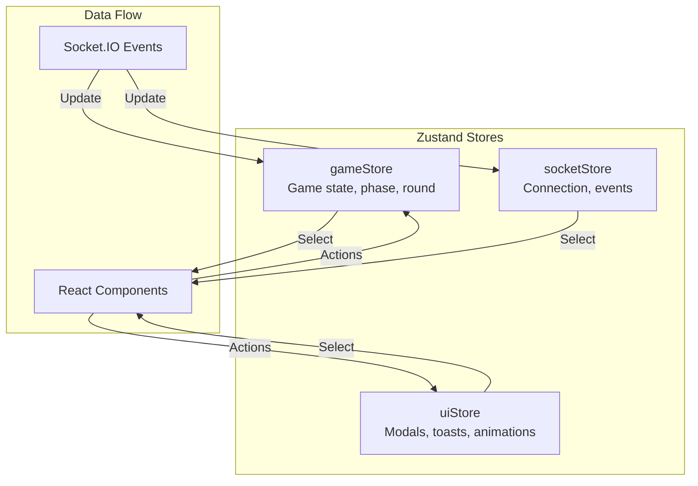
```mermaid
graph TD
    subgraph "Zustand Stores"
        GS["gameStore<br/>Game state, phase, round"]
        SS["socketStore<br/>Connection, events"]
        US["uiStore<br/>Modals, toasts, animations"]
    end

    subgraph "Data Flow"
        SOCKET_IO["Socket.IO Events"] -->|Update| GS
        SOCKET_IO -->|Update| SS
        GS -->|Select| COMPONENTS["React Components"]
        SS -->|Select| COMPONENTS
        US -->|Select| COMPONENTS
        COMPONENTS -->|Actions| GS
        COMPONENTS -->|Actions| US
    end
```

### 13.3 Store Definitions

```
gameStore:
  State:
    - roomCode, role, phase, currentRound, totalRounds
    - myTeam: { id, name, money, marketShare, tech, reputation, monopolyRisk, score }
    - allTeams: PublicTeamInfo[]
    - availableDecisions, selectedDecision
    - currentEvent, narration, activeQuiz
    - leaderboard
  Actions:
    - setPhase(), updateMyTeam(), updateAllTeams()
    - selectDecision(), submitDecision()
    - setEvent(), setNarration(), setQuiz()
    - resetGame()

socketStore:
  State:
    - connected, connecting, error
    - socket instance (ref, not state)
  Actions:
    - connect(), disconnect(), emit()

uiStore:
  State:
    - showEventOverlay, showNarrator, showQuizModal
    - toasts[], activeAnimations
  Actions:
    - showToast(), dismissToast()
    - toggleOverlay(), toggleModal()
```

### 13.4 Socket → Store Data Flow

```
Socket.IO event received
  → Socket event handler (in lib/socket.ts)
    → Calls gameStore.getState().updateMyTeam(data)  // Direct store mutation
    → No React re-render cascade
    → Only subscribed components update

Example:
  socket.on('team:stats-update', (data) => {
    gameStore.getState().updateMyTeam(data);
  });

  // In component:
  const money = useGameStore((s) => s.myTeam.money);  // Only re-renders when money changes
```

---

## 14. Coding Conventions

### 14.1 File Naming

| Type | Convention | Example |
|---|---|---|
| React components | `kebab-case.tsx` | `decision-card.tsx` |
| Pages (Next.js) | `page.tsx` in folder | `app/play/game/page.tsx` |
| Stores | `kebab-case.store.ts` | `game.store.ts` |
| Hooks | `use-kebab-case.ts` | `use-socket.ts` |
| Services | `kebab-case.service.ts` | `game.service.ts` |
| Controllers | `kebab-case.controller.ts` | `game.controller.ts` |
| Repositories | `kebab-case.repository.ts` | `game.repository.ts` |
| Engine modules | `kebab-case.engine.ts` | `decision.engine.ts` |
| Types | `kebab-case.types.ts` | `game.types.ts` |
| Utilities | `kebab-case.ts` | `room-code.ts` |
| JSON data | `kebab-case.json` | `quizzes.json` |
| CSS/Tailwind | Use Tailwind utility classes | — |

### 14.2 Folder Naming

```
All folders: kebab-case
  ✅ game-event.handler.ts
  ✅ socket/
  ✅ narrator/templates/
  ❌ GameEvent.handler.ts
  ❌ Socket/
  ❌ narratorTemplates/
```

### 14.3 TypeScript Best Practices

```
1. STRICT MODE:
   - Enable strict: true in all tsconfig.json files
   - No any types (use unknown + type guards)
   - No non-null assertions (use optional chaining)

2. TYPES vs INTERFACES:
   - Use 'type' for unions, intersections, mapped types
   - Use 'interface' for object shapes that may be extended
   - Export all types from dedicated .types.ts files

3. ENUMS:
   - Prefer string literal unions over enums
     type GamePhase = 'lobby' | 'countdown' | 'decision' | 'processing' | ...
   - Use const objects with 'as const' for lookup tables

4. FUNCTION SIGNATURES:
   - Always type return values explicitly for public functions
   - Use named parameters (object destructuring) for 3+ parameters
   - Document complex functions with JSDoc

5. ERROR HANDLING:
   - Use custom error classes extending Error
   - Never throw raw strings
   - Always catch and log in service layer

6. NULL HANDLING:
   - Use T | null (not T | undefined) for intentional absence
   - Use optional chaining (?.) and nullish coalescing (??)
   - Validate at boundaries (controllers, socket handlers)
```

### 14.4 Component Conventions

```
1. One component per file
2. Named exports (not default exports)
3. Props interface defined above component
4. Destructure props in function signature
5. Use forwardRef only when necessary
6. Co-locate component-specific hooks

Example structure:
  interface DecisionCardProps {
    decision: Decision;
    onSelect: (id: string) => void;
    disabled?: boolean;
  }

  export function DecisionCard({ decision, onSelect, disabled = false }: DecisionCardProps) {
    // ...
  }
```

### 14.5 Git Conventions

```
Branch naming:
  feature/game-engine
  feature/quiz-system
  fix/socket-reconnection
  chore/deployment-config

Commit messages (Conventional Commits):
  feat: add decision engine with effects table
  fix: prevent duplicate quiz submissions
  refactor: extract narrator template system
  docs: update architecture diagram
  chore: configure PM2 ecosystem
```

---

## 15. Future Extensibility

### 15.1 Adding New Business Decisions

```
1. Add entry to decision effects table in:
   server/src/engine/decision.engine.ts → effectsTable map

2. Add narration templates in:
   server/src/narrator/templates/decisions.json → new category

3. Add icon/UI in:
   client/src/components/game/decision-card.tsx → decision type switch

4. No database changes needed — decisions are stored as JSON
```

### 15.2 Adding New Random Events

```
1. Add event definition in:
   server/src/engine/event.engine.ts → eventPool array

2. Add narration templates in:
   server/src/narrator/templates/events.json → new category

3. Add event overlay visual in:
   client/src/components/game/event-overlay.tsx → event type switch

4. Optionally add educational concept mapping in:
   server/src/education/data/concepts.json
```

### 15.3 Adding New Quiz Packs

```
1. Create new questions in:
   server/src/education/data/quizzes.json → append to array

2. Each question specifies its own category and difficulty
3. Quiz engine auto-selects based on round number and category balance
4. No code changes needed — quiz engine reads from JSON
```

### 15.4 Adding New Industries / Scenarios

```
The game currently simulates a generic industry. To add specific industries:

1. Create an industry config file:
   server/src/engine/industries/electricity.json
   {
     "name": "Ngành Điện",
     "startingMoney": 15000,
     "decisions": [...],         // Industry-specific decisions
     "events": [...],            // Industry-specific events
     "monopolyThreshold": 40,    // Lower threshold for essential services
     "narrationPack": "electricity"
   }

2. Add industry narration templates:
   server/src/narrator/templates/industries/electricity.json

3. Add industry-specific quiz questions:
   server/src/education/data/quizzes-electricity.json

4. Host selects industry when creating game:
   host:create-game { industry: "electricity", ... }
```

### 15.5 Adding New AI Narrations

```
1. Add templates to appropriate JSON file in:
   server/src/narrator/templates/

2. Template format:
   {
     "id": "unique_id",
     "text": "Narration with {variables}",
     "conditions": { ... },      // When to use this template
     "type": "info|warning|education",
     "relatedConcept": "CONCEPT_KEY"
   }

3. If new variables are needed:
   - Add variable to narrator.types.ts
   - Add variable resolution in narrator.engine.ts → buildContext()

4. No restart needed if using hot-reload in development
```

### 15.6 Extension Points Summary

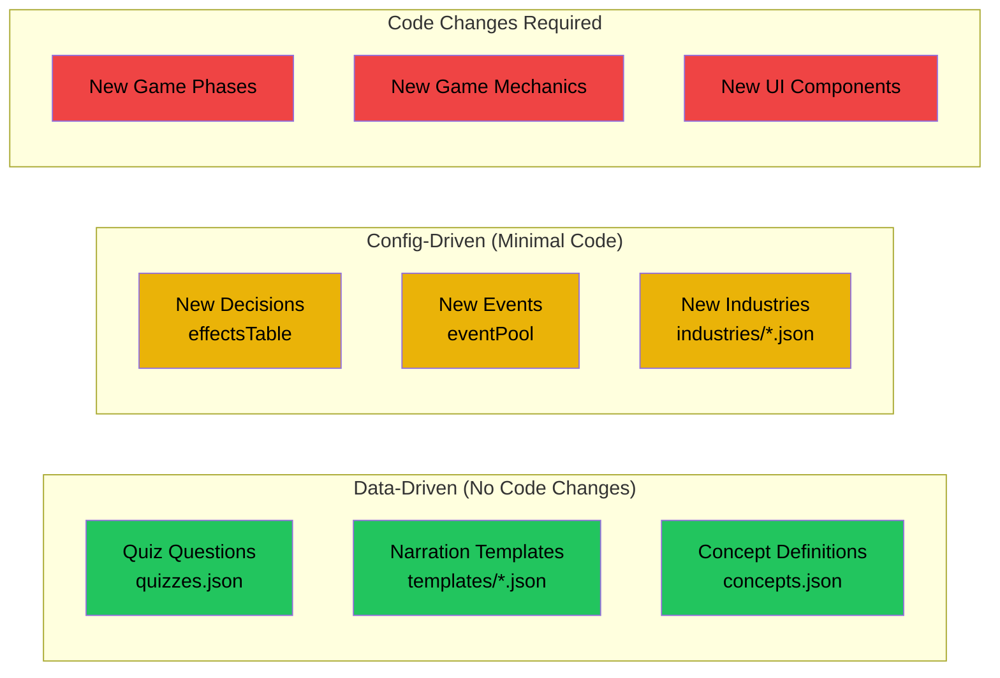
```mermaid
graph LR
    subgraph "Data-Driven (No Code Changes)"
        Q["Quiz Questions<br/>quizzes.json"]
        N["Narration Templates<br/>templates/*.json"]
        C["Concept Definitions<br/>concepts.json"]
    end

    subgraph "Config-Driven (Minimal Code)"
        D["New Decisions<br/>effectsTable"]
        E["New Events<br/>eventPool"]
        I["New Industries<br/>industries/*.json"]
    end

    subgraph "Code Changes Required"
        P["New Game Phases"]
        M["New Game Mechanics"]
        UI["New UI Components"]
    end

    style Q fill:#22c55e,color:#000
    style N fill:#22c55e,color:#000
    style C fill:#22c55e,color:#000
    style D fill:#eab308,color:#000
    style E fill:#eab308,color:#000
    style I fill:#eab308,color:#000
    style P fill:#ef4444,color:#000
    style M fill:#ef4444,color:#000
    style UI fill:#ef4444,color:#000
```

---

## Appendix A: Performance Budget

| Metric | Target | Rationale |
|---|---|---|
| WebSocket latency (server → client) | < 50ms | Real-time feel |
| Round processing time | < 500ms | All 9 teams processed |
| Page load (initial) | < 2s | First meaningful paint |
| JS bundle (game page) | < 300KB gzipped | Mobile-friendly |
| SQLite write (per round) | < 10ms | WAL mode, simple inserts |
| Memory (server total) | < 512MB | VPS constraint |
| Concurrent WebSocket connections | 20 | 18 players + 1 host + 1 projector |

## Appendix B: Technology Versions

| Technology | Version | Purpose |
|---|---|---|
| Node.js | 20 LTS | Runtime |
| Next.js | 14.x | Frontend framework |
| TypeScript | 5.x | Type safety |
| Express | 4.x | HTTP server |
| Socket.IO | 4.x | WebSocket layer |
| better-sqlite3 | 11.x | SQLite driver |
| Zustand | 4.x | State management |
| Framer Motion | 11.x | Animations |
| TailwindCSS | 3.x | Styling |
| shadcn/ui | Latest | UI component library |
| PM2 | 5.x | Process manager |
| Nginx | Latest stable | Reverse proxy |
| jsonwebtoken | 9.x | JWT auth |
| seedrandom | 3.x | Deterministic RNG |
| pino | 9.x | Logging |

---

## 16. Vietnamese Language Architecture

### 16.1 Language Principle

> **Rule:** Every character visible to the user MUST be in Vietnamese.  
> Only source code identifiers (variables, functions, classes, files, routes, DB columns) use English.

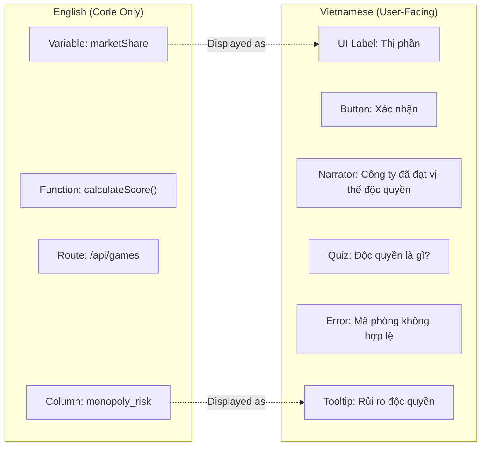
```mermaid
graph LR
    subgraph "English (Code Only)"
        VAR["Variable: marketShare"]
        FN["Function: calculateScore()"]
        ROUTE["Route: /api/games"]
        DB["Column: monopoly_risk"]
    end

    subgraph "Vietnamese (User-Facing)"
        UI["UI Label: Thị phần"]
        BTN["Button: Xác nhận"]
        NAR["Narrator: Công ty đã đạt vị thế độc quyền"]
        QUIZ["Quiz: Độc quyền là gì?"]
        ERR["Error: Mã phòng không hợp lệ"]
        TIP["Tooltip: Rủi ro độc quyền"]
    end

    VAR -.->|Displayed as| UI
    DB -.->|Displayed as| TIP
```

### 16.2 Text Source Architecture

All Vietnamese text comes from **three** sources — NEVER hardcoded in components or business logic:

| Source | Location | Purpose | Editable by Lecturer? |
|---|---|---|---|
| **UI Strings** | `client/src/i18n/vi.ts` | Buttons, labels, menus, errors, tooltips | No (requires rebuild) |
| **Game Content** | `content/` directory (JSON) | Decisions, events, quiz, narration | ✅ Yes |
| **Database** | SQLite (seeded from JSON) | Game session data | No (runtime) |

### 16.3 UI String Registry (`vi.ts`)

All static UI text is centralized in a single TypeScript file. Components NEVER contain raw Vietnamese strings.

```typescript
// client/src/i18n/vi.ts

export const vi = {
  // ====== Common ======
  common: {
    confirm: 'Xác nhận',
    cancel: 'Hủy',
    back: 'Quay lại',
    next: 'Tiếp tục',
    loading: 'Đang tải...',
    error: 'Đã xảy ra lỗi',
    retry: 'Thử lại',
    close: 'Đóng',
    submit: 'Gửi',
    ready: 'Sẵn sàng',
    waiting: 'Đang chờ...',
    copied: 'Đã sao chép!',
  },

  // ====== Landing Page ======
  landing: {
    title: 'MonopolyBattle',
    subtitle: 'Trò chơi mô phỏng Kinh tế Chính trị',
    joinGame: 'Vào game',
    hostGame: 'Tạo game (Giảng viên)',
    description: 'Trải nghiệm quá trình hình thành độc quyền qua mô phỏng kinh doanh',
  },

  // ====== Join Page ======
  join: {
    title: 'Tham gia trò chơi',
    roomCode: 'Mã phòng',
    roomCodePlaceholder: 'Nhập mã 6 ký tự',
    teamName: 'Tên đội',
    teamNamePlaceholder: 'VD: Công ty Ánh Dương',
    playerName: 'Tên người chơi',
    playerNamePlaceholder: 'Họ và tên',
    join: 'Tham gia',
    invalidCode: 'Mã phòng không hợp lệ',
    roomFull: 'Phòng đã đầy (tối đa 9 đội)',
    gameStarted: 'Trò chơi đã bắt đầu, không thể tham gia',
  },

  // ====== Host Page ======
  host: {
    title: 'Tạo trò chơi mới',
    pinLabel: 'Mã PIN giảng viên',
    pinPlaceholder: 'Nhập mã PIN',
    rounds: 'Số vòng chơi',
    roundDuration: 'Thời gian mỗi vòng (giây)',
    createGame: 'Tạo trò chơi',
    invalidPin: 'Mã PIN không đúng',
    startGame: 'Bắt đầu trò chơi',
    pauseGame: 'Tạm dừng',
    resumeGame: 'Tiếp tục',
    forceNext: 'Chuyển giai đoạn',
    endGame: 'Kết thúc trò chơi',
    triggerEvent: 'Tạo sự kiện',
    needMoreTeams: 'Cần ít nhất 2 đội sẵn sàng',
  },

  // ====== Lobby ======
  lobby: {
    title: 'Phòng chờ',
    roomCodeLabel: 'Mã phòng',
    teamsJoined: '{count} đội đã tham gia',
    waitingForHost: 'Đang chờ giảng viên bắt đầu...',
    teamReady: 'Sẵn sàng',
    teamNotReady: 'Chưa sẵn sàng',
    scanQR: 'Quét mã QR để tham gia',
    readyCount: '{ready}/{total} đội đã sẵn sàng',
  },

  // ====== Game ======
  game: {
    round: 'Vòng {current}/{total}',
    timeLeft: 'Còn lại: {seconds}s',
    selectDecision: 'Chọn quyết định kinh doanh',
    submitted: 'Đã gửi quyết định',
    waitingOthers: 'Đang chờ các đội khác ({count}/{total})',
    processing: 'Đang xử lý kết quả...',
    yourTeam: 'Đội của bạn',
    allTeams: 'Tất cả các đội',
    leaderboard: 'Bảng xếp hạng',
  },

  // ====== Stats ======
  stats: {
    money: 'Vốn',
    marketShare: 'Thị phần',
    technology: 'Công nghệ',
    reputation: 'Uy tín',
    monopolyRisk: 'Rủi ro độc quyền',
    totalScore: 'Tổng điểm',
    quizScore: 'Điểm câu hỏi',
    moneyUnit: 'tỷ VNĐ',
  },

  // ====== Decisions ======
  decisions: {
    investTech: 'Đầu tư công nghệ',
    acquireCompetitor: 'Thâu tóm đối thủ',
    mergeCompany: 'Sáp nhập công ty',
    reducePrices: 'Giảm giá sản phẩm',
    expandFactory: 'Mở rộng nhà máy',
    acceptGovSupport: 'Nhận hỗ trợ Nhà nước',
    lobbyGov: 'Vận động chính sách',
    export: 'Xuất khẩu',
    raisePrices: 'Tăng giá sản phẩm',
    notEnoughMoney: 'Không đủ vốn',
    alreadyChosen: 'Đã chọn vòng trước',
  },

  // ====== Quiz ======
  quiz: {
    title: 'Câu hỏi kiến thức',
    questionNumber: 'Câu hỏi {number}',
    timeLeft: 'Còn {seconds} giây',
    correct: 'Chính xác! 🎉',
    incorrect: 'Chưa đúng',
    explanation: 'Giải thích',
    pointsEarned: '+{points} điểm',
    noAnswer: 'Hết giờ — không trả lời',
    speedBonus: 'Thưởng tốc độ: +{points}',
  },

  // ====== Events ======
  events: {
    title: 'Sự kiện',
    economicCrisis: 'Khủng hoảng kinh tế',
    newCompetitor: 'Đối thủ mới xuất hiện',
    govInspection: 'Thanh tra của Nhà nước',
    laborStrike: 'Đình công lao động',
    techBreakthrough: 'Đột phá công nghệ',
    foreignInvestment: 'Đầu tư nước ngoài',
    naturalDisaster: 'Thiên tai',
    tradeAgreement: 'Hiệp định thương mại',
    consumerBoycott: 'Tẩy chay của người tiêu dùng',
  },

  // ====== Monopoly Detection ======
  monopoly: {
    detected: '⚠️ Phát hiện vị thế độc quyền!',
    intervention: 'Nhà nước can thiệp điều tiết thị trường',
    teamMonopoly: 'Đội {teamName} đã đạt vị thế độc quyền',
    explanation: 'Giải thích kinh tế học',
  },

  // ====== Game Over ======
  gameOver: {
    title: 'Kết thúc trò chơi',
    congratulations: 'Chúc mừng!',
    rank1: '🥇 Hạng nhất',
    rank2: '🥈 Hạng nhì',
    rank3: '🥉 Hạng ba',
    finalScore: 'Điểm cuối cùng',
    summary: 'Tổng kết',
    conceptsLearned: 'Khái niệm đã học',
    playAgain: 'Chơi lại',
    backToHome: 'Về trang chủ',
  },

  // ====== Narrator ======
  narrator: {
    label: 'MC AI',
    thinking: 'Đang phân tích...',
  },

  // ====== Projector ======
  projector: {
    title: 'Màn hình chiếu',
    enterCode: 'Nhập mã phòng để hiển thị',
    connect: 'Kết nối',
    noGame: 'Chưa có trò chơi nào đang diễn ra',
    submissionProgress: '{submitted}/{total} đội đã gửi quyết định',
  },

  // ====== Errors ======
  errors: {
    connectionLost: 'Mất kết nối, đang thử kết nối lại...',
    reconnected: 'Đã kết nối lại thành công!',
    serverError: 'Lỗi hệ thống, vui lòng thử lại',
    timeout: 'Hết thời gian chờ',
    invalidInput: 'Dữ liệu không hợp lệ',
    teamNameTaken: 'Tên đội đã được sử dụng',
    decisionLocked: 'Không thể thay đổi quyết định đã gửi',
    quizExpired: 'Đã hết thời gian trả lời',
  },

  // ====== Tooltips ======
  tooltips: {
    money: 'Số vốn hiện tại của công ty. Dùng để đầu tư và mở rộng.',
    marketShare: 'Phần trăm thị trường mà công ty kiểm soát. Thị phần cao có thể dẫn tới độc quyền.',
    technology: 'Trình độ công nghệ. Ảnh hưởng đến năng suất và khả năng cạnh tranh.',
    reputation: 'Uy tín của công ty trong mắt người tiêu dùng và xã hội.',
    monopolyRisk: 'Mức độ nguy cơ bị coi là độc quyền. Khi quá cao, Nhà nước sẽ can thiệp.',
  },
} as const;

export type VietnamLocale = typeof vi;
```

### 16.4 Component Usage Pattern

```typescript
// ✅ CORRECT — Use the i18n registry
import { vi } from '@/i18n/vi';

export function SubmitButton({ disabled }: { disabled: boolean }) {
  return <button disabled={disabled}>{vi.common.confirm}</button>;
}

export function MoneyDisplay({ amount }: { amount: number }) {
  return <span>{amount.toLocaleString('vi-VN')} {vi.stats.moneyUnit}</span>;
}

// ❌ WRONG — Hardcoded Vietnamese
export function BadButton() {
  return <button>Xác nhận</button>; // NEVER do this
}
```

### 16.5 Dynamic Text Interpolation

```typescript
// Utility function for template strings with {variable} placeholders
export function t(template: string, vars: Record<string, string | number>): string {
  return template.replace(/\{(\w+)\}/g, (_, key) => String(vars[key] ?? `{${key}}`));
}

// Usage:
t(vi.game.round, { current: 3, total: 8 })
// → "Vòng 3/8"

t(vi.lobby.teamsJoined, { count: 5 })
// → "5 đội đã tham gia"

t(vi.monopoly.teamMonopoly, { teamName: 'Công ty Ánh Dương' })
// → "Đội Công ty Ánh Dương đã đạt vị thế độc quyền"
```

### 16.6 Number & Currency Formatting

```typescript
// All numbers displayed to Vietnamese users use Vietnamese locale
const formatMoney = (amount: number): string => 
  `${amount.toLocaleString('vi-VN')} tỷ VNĐ`;

const formatPercent = (value: number): string =>
  `${value.toFixed(1)}%`;

// Examples:
formatMoney(15000)   // → "15.000 tỷ VNĐ"
formatPercent(42.5)  // → "42,5%" (Vietnamese uses comma as decimal)
```

### 16.7 Vietnamese Economic Terminology Reference

All educational content MUST use these standard Vietnamese terms from the Political Economics of Marxism-Leninism curriculum:

| English Term | Vietnamese Term | Context |
|---|---|---|
| Monopoly | Độc quyền | Core concept |
| State monopoly capitalism | Chủ nghĩa tư bản độc quyền nhà nước (CNTB ĐQNN) | Advanced concept |
| Natural monopoly | Độc quyền tự nhiên | Vietnam electricity/water |
| Capital accumulation | Tích tụ tư bản | Through surplus value |
| Capital concentration | Tập trung tư bản | Through mergers/acquisitions |
| Competition | Cạnh tranh | Base market state |
| Market share | Thị phần | Core stat |
| Profit | Lợi nhuận | Displayed as money |
| Merger | Sáp nhập | Decision type |
| Acquisition | Thâu tóm | Decision type |
| Monopoly alliance/cartel | Liên minh độc quyền | Advanced concept |
| State regulation | Điều tiết của Nhà nước | Government events |
| Surplus value | Giá trị thặng dư | Educational content |
| Means of production | Tư liệu sản xuất | Educational content |
| Relations of production | Quan hệ sản xuất | Educational content |
| Privatization | Tư nhân hóa | Vietnam context |
| Public ownership | Sở hữu công | Vietnam context |
| Essential services | Dịch vụ thiết yếu | Electricity, water |

---

## 17. Content Architecture

### 17.1 Content Separation Principle

> **Rule:** All educational content (quiz questions, narrator templates, event descriptions, concept explanations) MUST be stored as structured JSON files in the `content/` directory. NO Vietnamese content strings in React components or backend business logic.

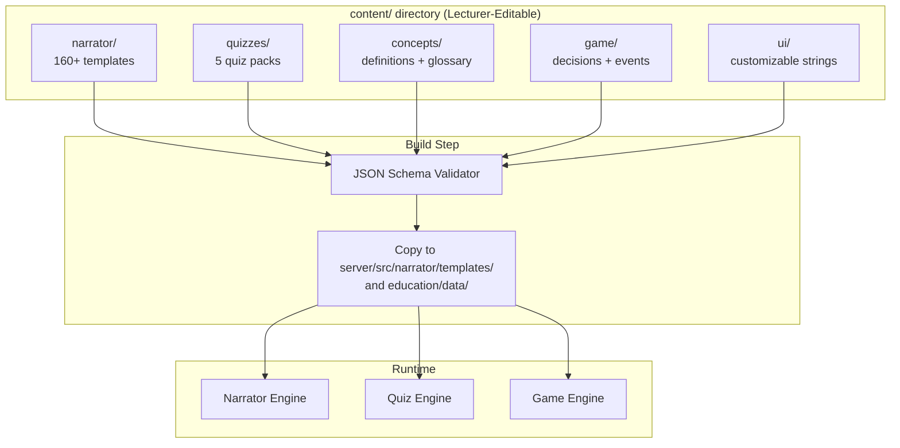
```mermaid
graph TB
    subgraph "content/ directory (Lecturer-Editable)"
        NARR["narrator/<br/>160+ templates"]
        QUIZ["quizzes/<br/>5 quiz packs"]
        CONC["concepts/<br/>definitions + glossary"]
        GAME["game/<br/>decisions + events"]
        UI_S["ui/<br/>customizable strings"]
    end

    subgraph "Build Step"
        VALIDATE["JSON Schema Validator"]
        COPY["Copy to server/src/narrator/templates/<br/>and education/data/"]
    end

    subgraph "Runtime"
        NARRATOR_ENG["Narrator Engine"]
        QUIZ_ENG["Quiz Engine"]
        GAME_ENG["Game Engine"]
    end

    NARR --> VALIDATE
    QUIZ --> VALIDATE
    CONC --> VALIDATE
    GAME --> VALIDATE
    UI_S --> VALIDATE
    VALIDATE --> COPY
    COPY --> NARRATOR_ENG
    COPY --> QUIZ_ENG
    COPY --> GAME_ENG
```

### 17.2 Content Directory Structure

```
content/
├── README.md                            # Guide for lecturers (in Vietnamese)
│
├── narrator/                            # AI Narrator templates
│   ├── decisions.json                   # 40+ templates for 9 decision types
│   ├── events.json                      # 30+ templates for 9 event types
│   ├── monopoly.json                    # 20+ monopoly detection narrations
│   ├── education.json                   # 20+ educational concept explanations
│   ├── round-summary.json              # 15+ round summary narrations
│   ├── government.json                  # 15+ government intervention narrations
│   ├── game-over.json                   # 10+ game conclusion narrations
│   └── vietnam-context.json            # 10+ Vietnam-specific narrations
│                                        # Total: ~160+ narrator templates
│
├── quizzes/                             # Quiz question packs
│   ├── monopoly-basics.json            # 5 questions: What is monopoly?
│   ├── monopoly-causes.json            # 5 questions: Causes of monopoly
│   ├── state-monopoly.json             # 5 questions: State monopoly capitalism
│   ├── vietnam-economy.json            # 5 questions: Vietnam electricity/water
│   └── capital-concentration.json      # 5 questions: Capital concentration/centralization
│                                        # Total: 25 quiz questions
│
├── concepts/                            # Educational definitions
│   ├── concepts.json                    # 10+ core economic concept definitions
│   └── glossary.json                    # 20+ Vietnamese economic terms with definitions
│
├── game/                                # Game content (non-narrator)
│   ├── decisions.json                   # Decision display names, descriptions, tooltips
│   ├── events.json                      # Event display names, descriptions, effect text
│   └── industries.json                  # Industry packs (future: electricity, water)
│
└── ui/                                  # Lecturer-customizable UI text
    └── strings.json                     # Override-able UI strings
```

### 17.3 Content JSON Schemas

#### Quiz Question Schema

```json
{
  "packId": "monopoly-basics",
  "packName": "Độc quyền là gì?",
  "description": "Câu hỏi cơ bản về khái niệm độc quyền",
  "questions": [
    {
      "id": "mb_001",
      "question": "Trong trò chơi, khi nào một công ty được coi là đạt vị thế độc quyền?",
      "options": [
        "Khi công ty chiếm hơn 50% thị phần",
        "Khi công ty có lợi nhuận cao nhất",
        "Khi công ty có công nghệ tiên tiến nhất",
        "Khi công ty nhận được hỗ trợ của Nhà nước"
      ],
      "correctIndex": 0,
      "explanation": "Theo kinh tế chính trị Mác-Lênin, độc quyền hình thành khi một hoặc một nhóm nhỏ doanh nghiệp kiểm soát phần lớn thị trường (thường trên 50% thị phần), từ đó có khả năng chi phối giá cả và loại bỏ cạnh tranh. Trong trò chơi, các bạn đã thấy điều này xảy ra khi một đội tích cực thâu tóm đối thủ.",
      "difficulty": 1,
      "relatedConcept": "MONOPOLY_DEFINITION",
      "roundSuggestion": 3
    },
    {
      "id": "mb_002",
      "question": "Theo quan điểm Mác-Lênin, tập trung tư bản khác với tích tụ tư bản ở điểm nào?",
      "options": [
        "Tập trung tư bản là hợp nhất nhiều tư bản nhỏ thành tư bản lớn, tích tụ tư bản là tăng quy mô bằng giá trị thặng dư",
        "Tập trung tư bản chỉ xảy ra ở nước phát triển",
        "Tích tụ tư bản là vi phạm pháp luật",
        "Không có sự khác biệt"
      ],
      "correctIndex": 0,
      "explanation": "Tích tụ tư bản (capital accumulation) là quá trình tăng quy mô tư bản bằng cách tái đầu tư giá trị thặng dư — tức là dùng lợi nhuận để mở rộng sản xuất. Tập trung tư bản (capital concentration) là quá trình hợp nhất nhiều tư bản nhỏ thành tư bản lớn hơn thông qua sáp nhập, thâu tóm. Trong trò chơi, khi các bạn chọn 'Thâu tóm đối thủ' hoặc 'Sáp nhập công ty', đó chính là tập trung tư bản.",
      "difficulty": 2,
      "relatedConcept": "CAPITAL_CONCENTRATION",
      "roundSuggestion": 5
    }
  ]
}
```

#### Decision Content Schema

```json
{
  "decisions": [
    {
      "type": "acquire_competitor",
      "displayName": "Thâu tóm đối thủ",
      "description": "Mua lại một công ty đối thủ cạnh tranh để mở rộng thị phần",
      "tooltip": "Chi phí cao nhưng tăng thị phần nhanh. Đây là hình thức tập trung tư bản.",
      "costPreview": "-5.000 tỷ VNĐ",
      "benefitPreview": "+8% thị phần",
      "riskNote": "Tăng rủi ro độc quyền đáng kể",
      "icon": "🏢",
      "educationalNote": "Thâu tóm đối thủ là biểu hiện của quá trình tập trung tư bản trong nền kinh tế thị trường."
    },
    {
      "type": "merge_company",
      "displayName": "Sáp nhập công ty",
      "description": "Hợp nhất với một công ty khác để tạo thành tập đoàn lớn hơn",
      "tooltip": "Tăng thị phần mạnh nhất nhưng rủi ro độc quyền rất cao. Đây là tập trung tư bản ở quy mô lớn.",
      "costPreview": "-3.000 tỷ VNĐ",
      "benefitPreview": "+12% thị phần",
      "riskNote": "Rủi ro độc quyền rất cao",
      "icon": "🤝",
      "educationalNote": "Sáp nhập là hình thức tập trung tư bản điển hình, dẫn tới hình thành các tập đoàn độc quyền."
    },
    {
      "type": "invest_tech",
      "displayName": "Đầu tư công nghệ",
      "description": "Nghiên cứu và phát triển công nghệ mới để nâng cao năng suất",
      "tooltip": "Chi phí vừa phải, tăng công nghệ và uy tín. Cải thiện khả năng cạnh tranh dài hạn.",
      "costPreview": "-2.000 tỷ VNĐ",
      "benefitPreview": "+15 công nghệ",
      "riskNote": "Rủi ro độc quyền thấp",
      "icon": "🔬",
      "educationalNote": "Đầu tư công nghệ là cách cạnh tranh lành mạnh, giúp tăng năng suất lao động."
    },
    {
      "type": "reduce_prices",
      "displayName": "Giảm giá sản phẩm",
      "description": "Hạ giá bán để thu hút thêm khách hàng và mở rộng thị phần",
      "tooltip": "Giảm lợi nhuận ngắn hạn nhưng tăng thị phần và uy tín. Chiến lược cạnh tranh phổ biến.",
      "costPreview": "-1.500 tỷ VNĐ",
      "benefitPreview": "+5% thị phần, +15 uy tín",
      "riskNote": "Rủi ro độc quyền thấp",
      "icon": "💰",
      "educationalNote": "Cạnh tranh qua giá cả là đặc trưng của thị trường tự do, nhưng cũng có thể dẫn tới chiến tranh giá cả."
    },
    {
      "type": "expand_factory",
      "displayName": "Mở rộng nhà máy",
      "description": "Xây dựng thêm cơ sở sản xuất để tăng sản lượng",
      "tooltip": "Tăng khả năng sản xuất và thị phần. Đây là tích tụ tư bản — mở rộng bằng lợi nhuận tái đầu tư.",
      "costPreview": "-4.000 tỷ VNĐ",
      "benefitPreview": "+4% thị phần, +5 công nghệ",
      "riskNote": "Rủi ro độc quyền trung bình",
      "icon": "🏭",
      "educationalNote": "Mở rộng sản xuất bằng tái đầu tư lợi nhuận chính là quá trình tích tụ tư bản."
    },
    {
      "type": "accept_gov_support",
      "displayName": "Nhận hỗ trợ Nhà nước",
      "description": "Chấp nhận trợ cấp và ưu đãi từ chính phủ",
      "tooltip": "Nhận tiền hỗ trợ nhưng phụ thuộc vào Nhà nước. Đây là biểu hiện của CNTB độc quyền nhà nước.",
      "costPreview": "+3.000 tỷ VNĐ",
      "benefitPreview": "+2% thị phần",
      "riskNote": "Rủi ro độc quyền cao (gắn với Nhà nước)",
      "icon": "🏛️",
      "educationalNote": "Khi Nhà nước hỗ trợ doanh nghiệp tư nhân, đó là biểu hiện của chủ nghĩa tư bản độc quyền nhà nước."
    },
    {
      "type": "lobby_gov",
      "displayName": "Vận động chính sách",
      "description": "Vận động hành lang để chính phủ ban hành chính sách có lợi",
      "tooltip": "Tăng thị phần qua quyền lực chính trị nhưng giảm uy tín xã hội. Liên minh giữa tư bản và quyền lực.",
      "costPreview": "-2.000 tỷ VNĐ",
      "benefitPreview": "+3% thị phần",
      "riskNote": "Rủi ro độc quyền rất cao, uy tín giảm mạnh",
      "icon": "📜",
      "educationalNote": "Vận động hành lang cho thấy mối quan hệ mật thiết giữa độc quyền tư nhân và bộ máy nhà nước."
    },
    {
      "type": "export",
      "displayName": "Xuất khẩu",
      "description": "Mở rộng thị trường ra quốc tế",
      "tooltip": "Tăng thị phần và uy tín ổn định. Mở rộng ra thị trường quốc tế là xu hướng toàn cầu hóa.",
      "costPreview": "-1.000 tỷ VNĐ",
      "benefitPreview": "+3% thị phần, +10 uy tín",
      "riskNote": "Rủi ro độc quyền thấp",
      "icon": "🌍",
      "educationalNote": "Xuất khẩu là biểu hiện của quá trình quốc tế hóa tư bản, xu hướng tất yếu của chủ nghĩa tư bản."
    },
    {
      "type": "raise_prices",
      "displayName": "Tăng giá sản phẩm",
      "description": "Tăng giá bán để tối đa hóa lợi nhuận",
      "tooltip": "Tăng vốn nhanh nhưng mất thị phần và uy tín. Khi thị phần lớn, đây là biểu hiện của lạm dụng vị thế độc quyền.",
      "costPreview": "+4.000 tỷ VNĐ",
      "benefitPreview": "-3% thị phần, -10 uy tín",
      "riskNote": "Rủi ro độc quyền trung bình",
      "icon": "📈",
      "educationalNote": "Khi doanh nghiệp có vị thế độc quyền, họ có quyền lực định giá — đây là mặt trái lớn nhất của độc quyền."
    }
  ]
}
```

#### Event Content Schema

```json
{
  "events": [
    {
      "type": "economic_crisis",
      "displayName": "Khủng hoảng kinh tế",
      "description": "Nền kinh tế rơi vào suy thoái, ảnh hưởng đến tất cả doanh nghiệp",
      "icon": "📉",
      "effectDescription": "Tất cả các đội: -2.000 tỷ VNĐ, -3% thị phần",
      "educationalNote": "Khủng hoảng kinh tế là biểu hiện của mâu thuẫn nội tại trong nền kinh tế tư bản chủ nghĩa, theo phân tích của Mác."
    },
    {
      "type": "gov_inspection",
      "displayName": "Thanh tra của Nhà nước",
      "description": "Cơ quan Nhà nước tiến hành thanh tra doanh nghiệp có dấu hiệu độc quyền",
      "icon": "🔍",
      "effectDescription": "Đội có rủi ro độc quyền cao nhất: -3.000 tỷ VNĐ, -5% thị phần",
      "educationalNote": "Nhà nước can thiệp để điều tiết thị trường là chức năng quan trọng, nhằm ngăn chặn độc quyền gây hại cho xã hội."
    }
  ]
}
```

### 17.4 Content Loading Architecture

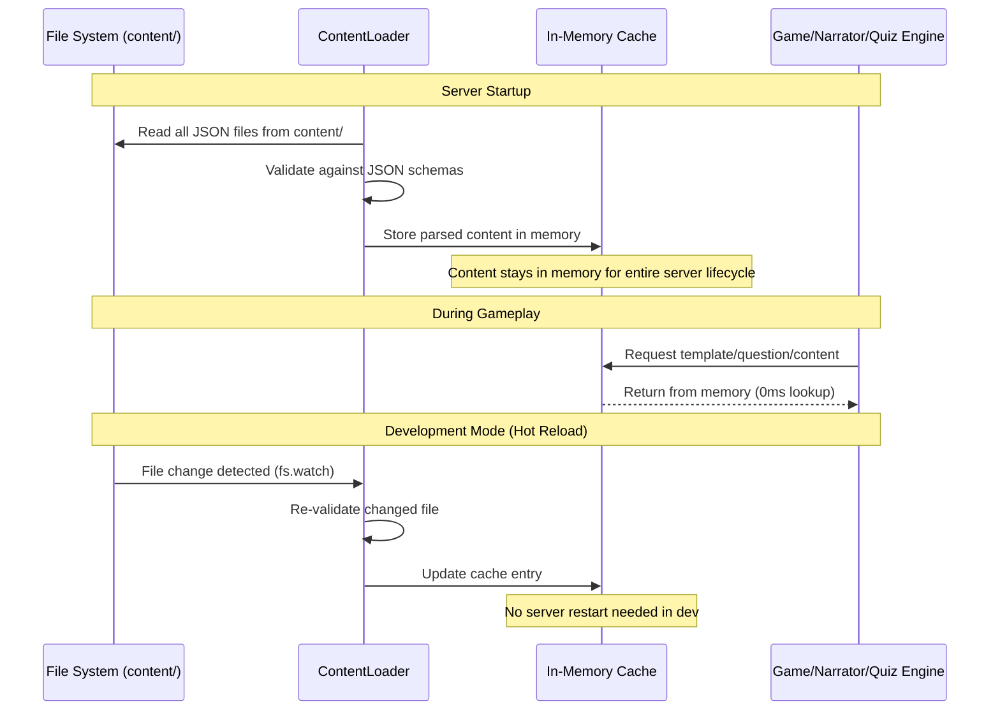
```mermaid
sequenceDiagram
    participant FS as File System (content/)
    participant LOADER as ContentLoader
    participant CACHE as In-Memory Cache
    participant ENGINE as Game/Narrator/Quiz Engine

    Note over FS,ENGINE: Server Startup
    LOADER->>FS: Read all JSON files from content/
    LOADER->>LOADER: Validate against JSON schemas
    LOADER->>CACHE: Store parsed content in memory
    Note over CACHE: Content stays in memory for entire server lifecycle

    Note over FS,ENGINE: During Gameplay
    ENGINE->>CACHE: Request template/question/content
    CACHE-->>ENGINE: Return from memory (0ms lookup)

    Note over FS,ENGINE: Development Mode (Hot Reload)
    FS->>LOADER: File change detected (fs.watch)
    LOADER->>LOADER: Re-validate changed file
    LOADER->>CACHE: Update cache entry
    Note over CACHE: No server restart needed in dev
```

### 17.5 Content Validation

```typescript
// Content is validated at startup using JSON Schema
// Invalid content prevents server from starting

interface ContentValidation {
  file: string;
  checks: [
    'JSON syntax valid',
    'Required fields present',
    'Template variables are valid ({teamName}, {marketShare}, etc.)',
    'Correct answer index within options range',
    'No empty strings in user-facing text',
    'Vietnamese characters present (not English placeholder)',
    'relatedConcept references valid concept ID',
  ];
}
```

### 17.6 Lecturer Content Editing Guide

The `content/README.md` file (written in Vietnamese) explains to lecturers how to:

| Task | File to Edit | Requires Rebuild? |
|---|---|---|
| Add/edit quiz questions | `content/quizzes/*.json` | Server restart (auto in dev) |
| Add/edit narrator templates | `content/narrator/*.json` | Server restart (auto in dev) |
| Change event descriptions | `content/game/events.json` | Server restart (auto in dev) |
| Change decision descriptions | `content/game/decisions.json` | Server restart (auto in dev) |
| Add economic concepts | `content/concepts/*.json` | Server restart (auto in dev) |
| Change UI text | `client/src/i18n/vi.ts` | Client rebuild required |

> **Lecturers should NEVER need to edit `.ts` or `.tsx` files.**  
> All educational content is in plain JSON with Vietnamese text.

---

## 18. Enhanced AI Narrator System

### 18.1 Scale Target

The narrator system is designed to hold **160+ Vietnamese templates** across 8 categories, ensuring that an 8-round game never repeats the same narration.

| Category | Template Count | Per-Type | Purpose |
|---|---|---|---|
| `decisions` | ~40 | 4–5 per decision type | Comment on business decisions |
| `events` | ~30 | 3–4 per event type | Explain random events |
| `monopoly` | ~20 | 5 per monopoly scenario | Explain monopoly detection |
| `education` | ~20 | 2–3 per concept | Explain economic theory |
| `round-summary` | ~15 | 3 per market condition | Summarize round outcomes |
| `government` | ~15 | 3 per intervention type | Government actions |
| `game-over` | ~10 | Various | Game conclusion |
| `vietnam-context` | ~10 | Various | Vietnam-specific insights |
| **Total** | **~160** | | |

### 18.2 Enhanced Template Structure

```json
{
  "category": "decisions",
  "subcategory": "acquire_competitor",
  "templates": [
    {
      "id": "acq_001",
      "text": "{teamName} vừa thâu tóm một đối thủ cạnh tranh. Thị phần tăng lên {marketShare}%. Đây là ví dụ điển hình của quá trình tập trung tư bản — khi các doanh nghiệp lớn hợp nhất doanh nghiệp nhỏ để mở rộng quy mô.",
      "conditions": {
        "minMarketShare": 0,
        "maxMarketShare": 25,
        "minMonopolyRisk": 0,
        "maxMonopolyRisk": 100,
        "roundRange": [1, 8]
      },
      "tone": "educational",
      "type": "education",
      "relatedConcept": "CAPITAL_CONCENTRATION",
      "priority": 1
    },
    {
      "id": "acq_002",
      "text": "Một đối thủ nữa bị {teamName} nuốt chửng! Thị phần hiện tại: {marketShare}%. Lịch sử kinh tế cho thấy, khi một doanh nghiệp kiểm soát ngày càng nhiều thị trường, cạnh tranh sẽ suy giảm và giá cả sẽ bị chi phối.",
      "conditions": {
        "minMarketShare": 25,
        "maxMarketShare": 45,
        "minMonopolyRisk": 0,
        "maxMonopolyRisk": 100,
        "roundRange": [1, 8]
      },
      "tone": "warning",
      "type": "warning",
      "relatedConcept": "MONOPOLY_DEFINITION",
      "priority": 1
    },
    {
      "id": "acq_003",
      "text": "⚠️ {teamName} tiếp tục thâu tóm! Thị phần đã đạt {marketShare}%. Ở mức này, người tiêu dùng gần như không còn sự lựa chọn. Đây chính là quyền lực độc quyền mà Mác đã phân tích — khi tư bản tập trung vào tay số ít.",
      "conditions": {
        "minMarketShare": 45,
        "maxMarketShare": 100,
        "minMonopolyRisk": 0,
        "maxMonopolyRisk": 100,
        "roundRange": [1, 8]
      },
      "tone": "critical",
      "type": "warning",
      "relatedConcept": "MONOPOLY_DEFINITION",
      "priority": 2
    },
    {
      "id": "acq_004",
      "text": "{teamName} mở rộng đế chế bằng cách thâu tóm thêm đối thủ. Với {money} tỷ VNĐ và {marketShare}% thị phần, công ty này đang trên con đường trở thành thế lực độc quyền. Câu hỏi đặt ra: Nhà nước có nên can thiệp?",
      "conditions": {
        "minMarketShare": 30,
        "maxMarketShare": 100,
        "minMonopolyRisk": 40,
        "maxMonopolyRisk": 100,
        "roundRange": [3, 8]
      },
      "tone": "provocative",
      "type": "education",
      "relatedConcept": "STATE_REGULATION",
      "priority": 1
    },
    {
      "id": "acq_005",
      "text": "Thêm một thương vụ thâu tóm của {teamName}. Trong lịch sử kinh tế, các tập đoàn lớn như Standard Oil (Mỹ) cũng hình thành bằng cách này. Kết quả? Chính phủ Mỹ phải ban hành Luật Chống độc quyền Sherman năm 1890.",
      "conditions": {
        "minMarketShare": 20,
        "maxMarketShare": 100,
        "minMonopolyRisk": 0,
        "maxMonopolyRisk": 100,
        "roundRange": [4, 8]
      },
      "tone": "historical",
      "type": "education",
      "relatedConcept": "CAPITAL_CONCENTRATION",
      "priority": 0
    }
  ]
}
```

### 18.3 Enhanced Condition System

Templates are selected based on rich game context, not just one variable:

| Condition Field | Type | Description |
|---|---|---|
| `minMarketShare` / `maxMarketShare` | number | Team's current market share range |
| `minMonopolyRisk` / `maxMonopolyRisk` | number | Team's monopoly risk range |
| `minMoney` / `maxMoney` | number | Team's current capital range |
| `minReputation` / `maxReputation` | number | Team's reputation range |
| `roundRange` | [min, max] | Which rounds this template can appear |
| `requiresEvent` | string? | Only if a specific event is active |
| `requiresPriorDecision` | string? | Only if team made a specific prior decision |
| `teamCountAbove` / `teamCountBelow` | number? | Market competition level |

### 18.4 Enhanced Selection Algorithm

```
1. Receive trigger: (category, subcategory, gameContext)

2. Load all templates for category + subcategory

3. Filter by ALL conditions:
   a. Market share within [min, max]
   b. Monopoly risk within [min, max]
   c. Money within [min, max] (if specified)
   d. Reputation within [min, max] (if specified)
   e. Current round within roundRange
   f. Required event active (if specified)
   g. Prior decision check (if specified)

4. Exclude recently used:
   - Remove templates used in last 3 rounds (increased from 2)
   - Track usage per category, not globally

5. Sort by priority (higher priority = more relevant to current situation)

6. From top-priority group, select randomly (seeded RNG)

7. Inject variables:
   {teamName}     → team.name
   {marketShare}  → team.marketShare.toFixed(1)
   {money}        → team.money.toLocaleString('vi-VN')
   {technology}   → team.technology
   {reputation}   → team.reputation
   {monopolyRisk} → team.monopolyRisk
   {round}        → gameState.currentRound
   {totalRounds}  → gameState.totalRounds
   {topTeam}      → leaderboard[0].name
   {eventName}    → currentEvent?.displayName

8. Return:
   {
     text: "Formatted Vietnamese narration",
     type: "education" | "warning" | "info",
     tone: "educational" | "warning" | "critical" | "provocative" | "historical",
     relatedConcept: "CONCEPT_ID",
     templateId: "acq_003"  // For usage tracking
   }
```

### 18.5 Template Tone System

The narrator adapts its tone based on game context:

| Tone | When Used | Vietnamese Style |
|---|---|---|
| `educational` | Early rounds, first-time concepts | Neutral, explanatory: "Đây là ví dụ của..." |
| `warning` | Team approaching monopoly | Alert, concerned: "⚠️ Cần lưu ý rằng..." |
| `critical` | Monopoly detected, intervention | Urgent, serious: "🚨 Tình trạng nghiêm trọng!" |
| `provocative` | Mid-to-late game, raise questions | Thought-provoking: "Câu hỏi đặt ra là..." |
| `historical` | Late game, complex concepts | Reference real examples: "Trong lịch sử kinh tế..." |
| `congratulatory` | Quiz correct, good decisions | Encouraging: "Xuất sắc! Chính xác!" |
| `reflective` | Game over, round summary | Looking back: "Nhìn lại vòng chơi vừa qua..." |

### 18.6 Multi-Team Narration

When multiple teams take the same action in one round, the narrator generates a **market-level** narration instead of individual ones:

```json
{
  "id": "multi_acq_001",
  "text": "Vòng này, {count} đội cùng lựa chọn thâu tóm đối thủ. Khi nhiều doanh nghiệp cùng tìm cách mở rộng bằng thâu tóm, thị trường sẽ nhanh chóng tập trung vào tay số ít. Đây chính là quá trình hình thành độc quyền mà V.I. Lênin mô tả trong tác phẩm 'Chủ nghĩa đế quốc'.",
  "conditions": {
    "minTeamsWithSameDecision": 3
  },
  "type": "education",
  "relatedConcept": "MONOPOLY_FORMATION"
}
```

### 18.7 Vietnam-Specific Narration Templates

Dedicated templates for Vietnam's economic context:

```json
{
  "category": "vietnam-context",
  "templates": [
    {
      "id": "vn_001",
      "text": "Hãy tưởng tượng nếu ngành điện Việt Nam hoàn toàn tư nhân hóa. Nếu một tập đoàn kiểm soát {marketShare}% thị phần điện — giống như {teamName} trong trò chơi này — họ có thể tăng giá điện tùy ý. 96 triệu người dân sẽ không có lựa chọn nào khác. Đây là lý do Việt Nam duy trì sở hữu nhà nước với EVN.",
      "conditions": { "minMarketShare": 40 },
      "trigger": "monopoly_detected",
      "type": "education",
      "relatedConcept": "VIETNAM_STATE_OWNERSHIP"
    },
    {
      "id": "vn_002",
      "text": "Ngành nước sạch Việt Nam là ví dụ của độc quyền tự nhiên. Không thể có 5 công ty cùng xây 5 hệ thống ống nước đến mỗi hộ gia đình — chi phí sẽ quá lớn và lãng phí. Vì vậy, Nhà nước quản lý ngành này để đảm bảo giá cả hợp lý và phục vụ mọi người dân.",
      "conditions": { "roundRange": [5, 8] },
      "trigger": "round_summary",
      "type": "education",
      "relatedConcept": "NATURAL_MONOPOLY"
    },
    {
      "id": "vn_003",
      "text": "Trong nền kinh tế thị trường định hướng xã hội chủ nghĩa, Việt Nam không phủ nhận vai trò của thị trường, nhưng Nhà nước giữ quyền kiểm soát các ngành thiết yếu. Điện, nước, viễn thông cơ bản — những ngành mà nếu để tư nhân độc quyền, người dân sẽ bị thiệt hại nặng nề.",
      "conditions": { "roundRange": [6, 8] },
      "trigger": "education",
      "type": "education",
      "relatedConcept": "VIETNAM_STATE_OWNERSHIP"
    }
  ]
}
```

### 18.8 Narration Timing & Display Rules

| Rule | Detail |
|---|---|
| **Max narrations per round** | 2 (1 decision narration + 1 event/monopoly narration) |
| **Priority order** | Monopoly detected > Government intervention > Event > Decision > Summary |
| **Display duration** | 6–10 seconds depending on text length |
| **Typewriter speed** | 40 characters/second (Vietnamese reads slightly slower than English) |
| **Projector narration** | Same text but larger font, displayed for 2 extra seconds |
| **Repetition window** | Same template cannot appear again for 3 rounds |
| **Multi-team threshold** | If 3+ teams choose the same decision, use multi-team template instead |

---

> **End of Architecture Document**  
> This document should be reviewed and approved before any implementation begins.  
> All diagrams use Mermaid syntax and can be rendered in any Mermaid-compatible viewer.
